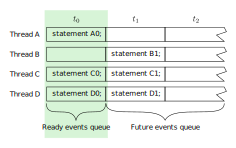
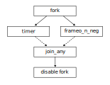

## Concurrency

### Testbenchs Require Concurrency

Components of the testbench run concurrently

- Concurrent components run as separate **threads**
- The Generator and Driver are concurrent components

<div style="text-align: center;">
  
</div>

### Concurrency in Simulator

A simulator can only execute one thread at a time in a single-core CPU

- Multiple thread waiting to execute at one simulation time point are scheduled in queues to run one-at-a-time

<div style="text-align: center;">
  
</div>

### Creating Concurrent Threads

Concurrent threads are created in a `fork-join` block

```verilog
int a, b, c;                 // parent variables
fork
  [fork local declarations]  // visible to all child threads
  statement0;                // child thread 1
  begin                      // child thread 2
    statement1;
    statement2;              // statement1 and statement2 execute sequentially
  end
join | join_any | join_none
statement3;
```

- Statements enclose in `begin-end` in a `fork-join` block are executed sequentially as a single concurrent child thread
- No predetermined execution order for concurrent threads

### How Many Child Threads?

A:

```verilog
fork
  begin
    recv();
  end
  begin
    send();
  end
join
```

Answer: Two child threads, one for each `begin`, `end` block

B:

```verilog
fork
  recv();
  send();
join
```

Answer: Two child threads, one each task

C:

```verilog
fork
  begin
    recv();
    send();
  end
join
```

Answer: One child threads, `recv()` and `send()` operate sequentially

D:

```verilog
fork
  begin
    begin
      recv();
      send();
    end
    check();
  end
join
```

Answer: One child threads, the outer `begin`, `end`, all tasks inside operate sequentially

### Join Options

```verilog
fork
  statement1;
  statement2;
  statement3;
join | join_any | join_none
statement4;
```

- `join`: Child threads execute and all child threads must complete before `statement4` is executed

- `join_any`: Child threads execute and one child threads must complete before `statement4` is executed. Other child threads continue to run

- `join_none`: Child threads are queued, `statement4` executes. Child threads not executed until parent thread encounter a blocking statement or completes

### Thread Execution

Once a thread executes

- It continues to execute until finished or a blocking statement is encountered
- Child threads generated by it are queued

When executing threads encounter a blocking statement

- It is queued and a queued ready thread executes

Time advances when all threads are blocked

Examples of blocking statements:

```verilog
@(vif.cb);
wait(var_a == 1);
#10;
join_any
join
```

### Thread Execution Model

One execution thread, all other threads reside on queues

- READY - to be executed ar current simulation time
- WAIT - blocked from execution until wait condition is met

When the executing thread is blocked, it moves to the WAIT queue

- The next READY thread then executes

Simulation time advances when all threads are in WAIT

### Thread Design (1/2)

Will this work?

```verilog
a = 0;
fork

  begin : thread_1
    while(a != 5) begin
      if($time > MAX_TIME) begin
        $finish;
      end
    end
  end

  begin : thread_2
    repeat(5) @(vif.cb);
    bus.cb.reg <= 1'b1;
    a = 5;
  end

join
```

Answer: No, because there is no blocking statement in `thread_1`

### Thread Design (2/2)

In multi-threaded programs, all threads must be finite or advance the clock!

```verilog
a = 0;
fork

  begin : thread_1
    while(a != 5) begin
      if($time > MAX_TIME) begin
        $finish;
      end else begin
        @(bus.cb);
      end
    end
  end

  begin : thread_2
    repeat(5) @(vif.cb);
    bus.cb.reg <= 1'b1;
    a = 5;
  end

join
```

### Thread vs Program Completion

```verilog
module test;
  initial begin
    for(int i = 0; i < 16; i++) begin
      send(i);
    end
  end

  task send(int j);
    fork
      begin
        $display("Driving port %0d", j);
        #1ns;
      end
    join_none
  endtask : send
endmodule
```

Simulation ends at time 0, Why?

With the `fork`, `join_none`, child thread are queued, this happens 16 times, and they are expected to run at time `1ns` but because there is no blocking statement after the `for` loop then the `initial` block ends at time zero and the threads are never executed. There is nothing preventing the `initial` block from ending.

It is important to note that the it is a good practice to put a `$finish` command at the end of the simulation,
otherwise the behavior is not the expected, also keep in mind that the `send()` task in the example above is 
using a `fork join_none` inside the task itself, which is considered a bad practice.

Because `module` and `program` schedule in different regions, to be more specific
`module` block will sample at active region and executes in the same region, 
where as program block will sample in active region and executes in reactive region,
some behaviors are not the same between them.

### Waiting for Child Threads to Finish

To prevent improper early termination of simulation, use `wait fork`

- Suspends parent thread until all children threads have completed execution

```verilog
module test;
  initial begin
    for(int i = 0; i < 16; i++) begin
      send(i);
    end
    wait fork;  // Blocking statement to control proper termination
  end           // of simulation

  task send(int j);
    fork
      begin
        $display("Driving port %0d", j);
        #1ns;
      end
    join_none
  endtask : send
endmodule
```

### Thread Execution Issues

```verilog
module test;
  initial begin
    for(int i = 0; i < 16; i++) begin
      fork
        send(i);
      join_none
    end
    wait fork;
  end

  task send(int j);
    $display("Driving port %0d", j);
    #1ns;
  endtask : send
endmodule
```

Output:

```plain
Driving port 16
Driving port 16
Driving port 16
Driving port 16
...
Driving port 16
Driving port 16
Driving port 16
```

Why?

Answer:

When the for `loop` is unrolled, all the threads are queued one after the other, but they do not execute immediately. Instead, all 16 threads are queued in the READY state. In this queue, 16 `send(i)` calls are waiting to execute, but none have started yet. Once the last thread is queued, all of them execute at the same time. However, by the time this happens, `i` has already reached 16. As a result, all the threads use the same value of `i`.

Threads scheduled for execution at current simulation time, but `i == 16` before they execute.

### Thread Execution Issues: Local Variable

Local variables once created are local to the child context

- Can copy parent variable in `fork` declarative space

```verilog
module test;
  initial begin
    for(int i = 0; i < 16; i++) begin
      fork
        automatic int index = i;   // local fork variable
        send(index);
      join_none
    end
    wait fork;
  end

  task send(int j);
    $display("Driving port %0d", j);
    #1ns;
  endtask : send
endmodule
```

Output:

```plain
Driving port 0
Driving port 1
Driving port 2
...
Driving port 15
```

Variables are created in the declarative space of each `fork`, `join_none`

### Implement Watch-Dog Timer with `join_any`

Typically used in conjunction with `disable fork`

```verilog
task recv();
  fork
    begin : frameo_n_neg
      wait(vif.cb.frameo_n[7] !== 1'b0);
      @(vif.cb iff(vif.cb.frameo_n[7] === 1'b0) );
    end
    begin : timer
      repeat(1000) @(vif.cb);
      $display("Timed out!");
      $finish;
    end
  join_any
  disable fork;  // Kills all child threads!
  get_payload();
endtask
```

<div style="text-align: center;">
  
</div>

### Avoid `disable fork` problems

Use enclosing `fork join` to localize `disable fork`

```verilog
task recv();
  fork begin // enclosing fork-join
    fork        // You can use : revc_wd_timer
      begin : frameo_n_neg
        wait(vif.cb.frameo_n[7] !== 1'b0);
        @(vif.cb iff(vif.cb.frameo_n[7] === 1'b0) );
      end

      begin : timer
        repeat(1000) @(vif.cb);
        $display("Timed out!");
        $finish;
      end
    join_any

    disable fork;  // Kills all child threads
    // disable recv_wd_timer;          this is legal but NOT RECOMMENDED
  end join
  get_payload();
endtask
```

One thing you have to be aware is that `disable fork` works differently for `forks` issued inside classes vs outside classes.

The rule for `disable fork` is that it is going to disable all child processes including any child processes that where created by the original caller.

So if this task was called from another place where they were others threads running we are going to disable those threads as well. The solution is to put a `fork join` around the entire task.

So now the `disable fork` will only work within this two threads and not any threads outside of this.

You can also `disable fork` by level, but in classes if you have multiple objects of the same class all objects will be disable, not just the one you called.

