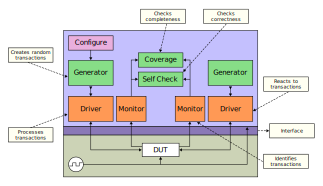
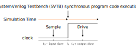
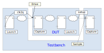
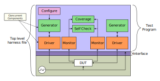
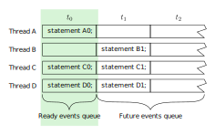
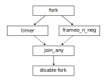

# SystemVerilog notes

## Acronyms

LRM -> Language Reference Manual

## Well Designed Verification Environment

Test Environment must:

- Be structure for Debug
- Avoid false positives

Test must:

- Achieve Functional Coverage
  - Prevent untested regions
- Reach Corner Cases
  - Anticipated Cases
  - Error Injection
    - Environment Error
    - DUT Error
  - Unanticipated Cases
    - Random Tests
- Be robust, reusable, scalable

## SystemVerilog Test Environment

<div style="text-align: center;">
  
</div>

## SystemVerilog - Key Features

SystemVerilog introduces two new design units

- The `program` block (**NOT RECOMMENDED TO USE**)
  - Use `module` instead
  - Is where you develop testbench code
  - Is entry point for testbench execution
- The `interface`
  - Is mechanism to connect testbench to DUT
  - Is a named bundle of wires
  - Can be passed just like a port in a port list
  
SystemVerilog testbenches uses Object Oriented Programming (OOP)

- Uses `class` definition

## Program Block - Encapsulate Test Code

The `program` block provides

- Entry point to test execution
- Scope for program-wide data and routines
- Race-free iteration between testbench and design

Develop test code in `program` code

- Can also use a `module` block

```verilog
program automatic test(router_if.TB vif);
  initial begin
    run();
  end
  
  task run();
  ...
  endtask : run
endprogram : test
```

## Interface - Encapsulate Connectivity

An `interface` encapsulates the communication between DUT and testbench including

- Connectivity (signals) - name bundle of wires
  - One or more bundles to connect modules and tests
  - Can be reused for different tests and devices
- Directional information (`modports`)
- Timing (`clocking` blocks)
- Functionality (`task`, `function`, assertions, `initial/always` blocks)

Solves many problem with traditional connections

- Port list for he connections are compact
- Easy to add new connections
- Opportunity to pass DUT connections throughout the testbench (virtual interfaces)

## Comparing SystemVerilog Containers

| `module`           | `interface`        | `program`     | `class`       |
| ------------------ | ------------------ | ------------- | ------------- |
| modules intance    |                    |               |               |
| interface instance | interface instance |               |               |
| `clocking`         | `clocking`         | `clocking`    |               |
| `class`            | `class`            | `class`       | `class`       |
| object             | object             | object        | object        |
| `reg (logic)`      | `reg (logic)`      | `reg (logic)` | `reg (logic)` |
| variable           | variable           | variable      | variable      |
| `wire`             | `wire`             | `wire`        |               |
| `assign`           | `assign`           | `assign`      |               |
| `initial/always`   | `initial/always`   | `initial`     |               |
| `task`             | `task`             | `task`        | `task`        |
| `function`         | `function`         | `function`    | `function`    |

## Interface - An Example

The RTL code is connected with bundled signals

```verilog
module test(simple_bus sb);
...
endmodule
```

```verilog
module cpu(simple_bus sb);
...
endmodule
```

```verilog
interface simple_bus();
  logic req, gnt;
  logic [7:0] addr;
  wire  [7:0] data;
  logic [7:0] mode;
  logic start, rdy;
endinterface
```

```verilog
module top;
  logic clk = 0;
  always begin
    #10 clk = !clk;
    simple_bus sb(clk);
    test t1(sb);
    cpu c1(sb);
  end
endmodule
```

## Synchronous Timing: `clocking` Blocks

Are just for testbench

- Emulates the launch and captures flops at IO of DUT

Create explicit synchronous timing domains

- All signals driven or sampled at clocking event
  - By default all interface signals are asynchronous
- Interaction between testbench and DUT ideally happens only at clock edges (cycle-based)

Specify signal direction

- Outputs can not be sampled
- Input signals cannot be driven

Multiple clocking blocks supported

- Active driver
- Reactive driver
- Monitor

```verilog
clocking cb @(posedge clock);
  default input #1ns output #1ns;
  output reset_n;
  output din;
  output frame_n;
  output valid_n;
  input  dout;
  input  valido_n;
  input  busy_n;
  input  frameo_n;
endclocking : cb
```

## Signal Direction Using `modport`

Enforce signal access and direction with `modport`

```verilog
interface router_if (input logic clock);
  logic         reset_n;
  ...
  logic [15:0]  frameo_n;

  clocking cb @(posedge clock);
    default input #1ns output #1ns;
    output reset_n;
    ...
    input  frameo_n;
  endclocking : cb

  modport DUT(input reset_n, input din, output dout, ...);
  modport TB(clocking cb, output reset_n);
endinterface: router_if
```

```verilog
module test (router_if.TB vif);
  initial begin
    vif.reset_n = 'd0;
    vif.cb.frame_n <= '1;
    vif.cb.valid_n <= '1;
  end
endmodule : test
```

```verilog
module router (router_if.DUT vif, input logic clock);
...
endmodule : router
```

## A complete `interface`

```verilog
interface router_if (input logic clock);
  // Named bundle of asynchronous signals
  logic         reset_n;
  logic [15:0]  din;
  logic [15:0]  frame_n;
  logic [15:0]  valid_n;
  logic [15:0]  dout;
  logic [15:0]  valido_n;
  logic [15:0]  busy_n;
  logic [15:0]  frameo_n;

  // Create synchronous behavior by placing into `clocking` block
  clocking cb @(posedge clock);
    default input #1ns output #1ns;  // Sample and drive skews
    output reset_n;
    output din;
    output frame_n;
    output valid_n;
    input  dout;
    input  valido_n;
    input  busy_n;
    input  frameo_n;
  endclocking : cb

  // Defines access and direction with modport
  modport TB(clocking cb, output reset_n);  // Synchronous and Asynchronous behavior
endinterface: router_if
```

## Driving and Samplign DUT Signals

DUT signals are driven in the device driver

DUT signals are sampled in the device monitor

## SystemVerilog Testbench Timing

Clocking clock emulates synchronous drives and samples

- Driving and sampling events occur at clocking event

<div style="text-align: center;">
  
</div>

$$
\begin{array}{lll}
\text{Sample} & = & t_{0} - \text{Input Skew} \\
\text{Drive}  & = & t_{0} + \text{Output Skew}
\end{array}
$$

## Input and Output Skews

<div style="text-align: center;">
  
</div>

Output Skew is the `clk2q` delay of the launch flop for the DUT input

- Defaults to `#0`

Input Skew is the `setup` time of the capture flop for the DUT output

- Defaults to `#1step` - preponed region of simulation step

## SystemVerilog Scheduling

Each time slot is divided into 5 major regions

- `Preponed` Sample signal before any changed (`1#step`)
- `Active`   Design simulation (`modules`), including NBA (Non-Blocking Assignments)
- `Observed` Assertions evaluated after design executes
- `Reactive` Testbench activity (`program`)
- `Postponed` Read only phase

| Region      | Activity   |
| ----------- | ---------- |
| `Preponed`  | sample     |
| `Active`    | design     |
| `Observed`  | assertions |
| `Reactive`  | testbench  |
| `Postponed` | `$monitor` |

## Synchronous Drive Statements

```verilog
interface.cb.signal <= <values|expression>;
```

Drive must be non-blocking

Driving of input signals is not allowed

Example:

```verilog
vif.cb.din[3] <= var_a;
```

## Sampling Synchronous Signals

```verilog
variable = interface.cb.signal;
```

Variable is assigned the sampled value

- Value that the clocking clock sampled at the most recent clocking event

Avoid non-blocking assignment

Sampling of output signal is not allowed

Example:

```verilog
data[i] = vif.cb.dout[7];
```

## Using Interface in Program

```verilog
// Pass modport as port list
program automatic test(router_if.TB vif);
  initial begin
    reset();
  end
  
  task reset();
    vif.reset_n = 1'b0;          // Asynchronous signals are driven without reference to clocking block
    vif.cb.frame_n <= 16'hffff;  // Synchronous signals are referenced via clocking block
    vif.cb.valid_n <= ~('b0);
    repeat(2) @(vif.cb);
    vif.cb.reset_n <= 1'b1;
    repeat(15) @(vif.cb);        // Advance clock cycles via clocking block
  endtask

endprogram: test
```

## Complete Top-Level Harness

Instantiate test program and interface in harness file

```verilog
// Legacy DUT (wires)
module router(
  reset_n, din, frame_n, valid_n, dout,
  valido_n, busy_n, frameo_n
);
...
endmodule
```

```verilog
module router_test_top;
  parameter simulation_cycle = 100;
  bit SystemClock;

  // Instantiate interface
  router_if vif(SystemClock);    // Connect SystemCLock to interface block
  
  // Instantiate test program
  test router_test(vif)

  // Instantiate DUT using interface connection
  router dut(
    .reset_n   (vif.reset_n),
    .din       (vif.din),
    .frame_n   (vif.frame_n),
    .valid_n   (vif.valid_n),
    .dout      (vif.dout),
    .valido_n  (vif.valido_n),
    .busy_n    (vif.busy_n),
    .frameo_n  (vif.frameo_n)
  );
  
endmodule
```

## Compile RTL and Simulate with VCS

Compile HDL code: (generate `simv` simulation binary)

```plain
top_test.sv    // Test code
router_if.sv   // Interface
tb.sv          // Harness
router.sv      // RTL
```

This is the basic way to compile and simulate:

```plain
vcs -sverilog -debug_access+all tb.sv test.sv router_if.sv router.v
```

```plain
./simv
```

But it is recommended to use a Makefile instead:

```makefile
ROOT_DIR := $(CURDIR)
CUR_DATE := $(shell date +%Y-%m-%d_%H-%M-%S)
RUN_DIR := $(CURDIR)/work

SEED ?= 1
PLUS ?=

RTL_PATH = $(abspath $(ROOT_DIR)/../rtl)
RTL_FILES = $(RTL_PATH)/router.v
SVE = -F $(ROOT_DIR)/sve.f
FILES = $(RTL_FILES) $(SVE)

VCS = vcs -full64 -sverilog \
   -lca -debug_access+all -kdb +vcs+vcdpluson \
   -timescale=1ns/100ps $(FILES) -l comp.log \
   -top tb

SIM_OPTS = -l simv.log \
            +$(PLUS)

.PHONY: compile clean help

all: help

compile: 
 @mkdir -p $(RUN_DIR)/sim
 cd $(RUN_DIR)/sim && $(VCS)

sim: 
 cd $(RUN_DIR)/sim && ./simv +ntb_random_seed=${SEED} $(SIM_OPTS)

random: 
 cd $(RUN_DIR)/sim && ./simv +ntb_random_seed_automatic $(SIM_OPTS)

verdi:
 cd $(RUN_DIR)/sim && verdi -dbdir ./simv.daidir -ssf ./novas.fsdb -nologo &

clean:
 rm -rf $(RUN_DIR)

help: 
 @echo ""
 @echo "=================================================================="
 @echo ""
 @echo "---------------------------- Targets -----------------------------"
 @echo " compile             : Runs compilation"
 @echo " sim                 : Runs simulation with default seed"
 @echo " random              : Runs simulation with random seed"
 @echo " clean               : Delete work/ directory"
 @echo "=================================================================="
 @echo ""
 @echo "--------------------------- Variables ----------------------------"
 @echo "  SEED                : Random seed used, must be an integer > 0"
 @echo "  PLUS                : Add extra flags in simv command"
 @echo ""
```

`sve.f` (Simulation Verification Environment) files

```plain
+incdir+tests
+incdir+tb
+incdir+sv
sv/router_if.sv
test/top_test.sv
tb/tb.sv
```

For more information about all the flags refer to [VCS/SIMV docs](vcs_simv_docs.md).

## SystemVerilog Run-Time Options

Pass values form simulation command line using `+argument`

Retrieve `+argument` value with `$value$plusargs()`

```verilog
initial begin : proc_user_args
  int value;
  if ($value$plusargs("custom=%d", value)) begin
    $display("The value is: %2d", value);
  end else begin
    $display("Using default seed");
  end
end : proc_user_args
```

```plain
./simv +custom=10
```

Create your own argument options for simulation control and debug

## SystemVerilog Testbench Code Structure: `module`

Test code can be embedded inside `module` block

- `module` is instantiated in the top-level harness file

```verilog
// Compile unit scope variables
`include <files>
module name(interface);
  `include <files>
  // Program global scope variables
  initial begin
  // Local scope variables
  // Top-level test code
  end
  
  task task_name(...);
  // task local scope variables
  // task code
  endtask
endmodule
```

```verilog
module test(...);
  initial begin
    $fsdbDumpvars;
    reset();
  end
  task reset(...);
  ...
  endtask
endmodule
```

```verilog
module tb;
  router_if vif(SystemClock);
  test top_test(vif);
  router dut (...);
endmodule
```

## Lexical Convention

Same as Verilog

- Case sensitive identifiers (names)
- White spaces are ignored except within strings
- Comments
  - Single line `//`
  - Multi line `/* */`

Number format

```plain
<size>'<base><number>
```

```plain
'b  (binary)        :[01xXzZ]
'd  (decimal)       :[0123456789]
'o  (octal)         :[01234567xXzZ]
'H  (HEXADECIMAL)   :[0123456789ABCDEEFABCDEEFxXzZ]
```

Can be padded with `_` (underscore) for readability

```plain
16'b_1100_1011_1010_0010
32'h_beef_cafe
```

## Data types

A datatype is a set of values (2-state or 4-state) that can be used to declare data objects or to define user-defined data types
The Verilog data types have 4-state values: (`0`, `1`, `Z`, `X`).

SystemVerilog adds 2-state value types based on bit:

- Has values 0 and 1 only.
- Direct replacements for reg, logic or integer.
- Greater efficiency at higher-abstraction level modeling (RTL).
- You can add the `unsigned` keyword after as a modifier.

| Type       | Description                     | Sign             |
| ---------- | ------------------------------- | ---------------- |
| `bit`      | Single bit, Scalable to vector  | Default unsigned |
| `byte`     | 8-bit vector or ASCII character | Default signed   |
| `shortint` | 16-bit vector                   | Default signed   |
| `int`      | 32-bit vector                   | Default signed   |
| `longint`  | 64-bit vector                   | Default signed   |

The keyword `logic` defines that the variable or net is a 4-state data type.

## 2-State (1|0) Data Types (1/3)

```plain
bit [msb:lsb] var_name [=initial_value]
```

Better compiler optimizations for better performance

Variable initialized to `'0` if `initial_value` is not specified

- `'0` is unsized literal, it will expand the variable name to the number of bits automatically

Assigned `0` for `x` or `z` value assignments

- Sized as specified
- Defaults to `unsigned`

```verilog
bit flag;
bit[15:0] sample, temp = 16'hdeed;
bit[7:0] a = 8'b1;         //  8'b0000_0001
bit[7:0] b =  'b1;         //  8'b0000_0001
bit[7:0] c =  '1;          //  8'b1111_1111
bit[32:0] signed ref_data = -155;
```

## 2-State (1|0) Data Types (2/3)

```plain
2-state-type variable_name [=initial_value];
```

Sized integral 2-state data types:

- `byte`     - 8-bit signed data type
- `shortint` - 16-bit signed data type
- `int`      - 32-bit signed data type
- `longint`  - 64-bit signed data type

```verilog
shortint temp = 256;
int sample, ref_data = -9876;
longint a, b;
longint unsigned testdata;
```

## 2-State (1|0) Data Types (3/3)

Real 2-state data types:

- `real`      - Equivalent to `double` in C
- `shortreal` - Equivalent to `float` in C
- `realtime`
  - 64-bit real variable for use with `$realtime`
  - Can be used interchangeably with `$real` variables

```verilog
real alpha = 100.3, cov_result;
realtime t64;
t64 = $realtime;
cov_result = $get_coverage();
if (cov_result == 100.0) begin
...
end
```

## 4-State (1|0|X|Z) Data Types (1/2)

```plain
reg | logic [msb:lsb] variable_name [=initial_value]
```

Variables must be 4-state to emulate correct hardware behavior in simulation

- `reg` and `logic` are synonyms
- Used to drive/store DUT interface signals in testbench
- Initialized to `'x` if initial_value is not specified
  - `'x` in unsized literal
- Can be used in continuous assignment (single drive only), unlike `reg`
- Can be used as outputs of modules
- Defaults to `unsigned`

```verilog
logic[15:0] sample = '1, ref_data = 'x;
assign sample = vif.cb.dout;
```

## 4-State (1|0|X|Z) Data Types (2/2)

Sized 4-state data types

```verilog
integer variable_name [=initial_value]
```

- 32-bit signed data type

```verilog
time variable_name [=initial_value]
```

- 64-bit unsigned data type

```verilog
integer a = -100, b;
time current_time;
b = -a;
current_time = $time;
if (current_time > 100ms)
```

You can use time units in SystemVerilog

## String Data Type

```verilog
string variable_name [=initial_value]
```

Default to empty string `""`

Can be created with `$sformatf()` system function

Built-in operator and methods:

- `==`, `!=`, `compare()`, and `icompare()`
- `itoa()`, `atoi()`, `atohex`, `toupper()`, `tolower()`, etc
- `len()`, `getc()`, `putc()`, `substr()`
- See SystemVerilog LRM for more

```verilog
string name, s = "Now is the time";
for (int i=0; i<4; i++) begin
  name = $sformatf("string%0d", i);
  $display("%s, upper: %s", name, name.toupper());
end
s.put(s.len()-1, s.getc(5))
$display(s.substr(s.len()-4, s.len()-1))
```

`sformat`: This function formats a string and stores the result in a pre-existing string variable. It returns an integer indicating the number of characters written. You must pass the string variable as the first argument.

```verilog
string formatted_str;
int len = sformat(formatted_str, "Value: %0d", 42);
```

`sformatf`: This function works like sprintf in C. It formats a string and returns the result directly as a string without needing a pre-existing variable.

```verilog
string formatted_str = sformatf("Value: %0d", 42);
```

## Enumerated Data Types

Define enumerated type

```verilog
typedef enum [data_type] {named constants} enumtype;
```

Declare enum variables

```verilog
enumtype var_name [=initial_value];
```

- Data type default to `int`
- Variable initialized to `'0` if `initial_value` is not specified (`x` for a 4 state data_type)
- `enum` can be displayed as ASCII or value

```verilog
typedef enum bit[2:0] {IDLE=1, TEST, START} state_e;
state_e current, next = IDLE;
$display("current = %0d, next = %s", current, next);
$display("next = %p", next);
```

## Data Arrays - Fixed-size Arrays (1/4)

```verilog
type array_name[size] = [=initial_value];
```

```verilog
interger numbers[5];                       // arrays of 5 integers, indexed 0 - 4
int b[2] = '{3,7};                         // b[0] = 3, b[1] = 7

bit[31:0] c[2][3] = '{{3,7,1},{5,1,9}};    // Multidimensional
byte d[7][2] = '{default:-1};              // all elements set = -1

bit[31:0] a[2][3] = c;                     // array copy - types and sizes must be same
for (int i=0; i<$dimensions(a), i++) begin
  $display($size(a, i+1));                 // 2 3 32
end
```

`$size` returns size of particular dimension

`$dimensions` returns number of dimensions

## Data Arrays - Dynamic Arrays (2/4)

```verilog
type array_name[size] = [=initial_value];
```

Array size allocated at runtime with constructor

```verilog
logic[7:0] ID[], array1[] = new[16];
logic[7:0] data_array[], mdim[][];

ID = new[100];                     // allocate memory

data_array = new[ID.size()] (ID);  // copy types must match, constructor and copy
data_array = ID                    // Just copy

ID = new[ID.size() * 2] (ID);      // double the size of ID
ID = data_array;                   // ID resized to match data_array
data_array.delete();               // de-allocate memory
```

## Data Arrays - Queues (3/4)

```verilog
type array_name[$[:bound]] = [=initial_value];
```

You do not have to specify the size

Array memory allocated and de-allocated at runtime with

- `push_back()`, `push_front()`, `intert()`
- `pop_back()`, `pop_front()`, `delete()`

Can not be allocated with `new[]`

- `bit[7:0] ID[$] = new[16];  // Compilation error`

Index `0` refers to lower (first) index in queue

Index `$` refers to upper (last) index in queue

Can be operated on as an array, FIFO or stack

Optional bound in declaration is last index

```verilog
int j = 2;
int q[$] = {0,1,3,6};     // note no '
int b[$] = {4,5};         // note no '
q.insert(2,j);            // {0,1,2,3,6}
q.insert(4, b);           // {0,1,2,3,4,5,6}
q.delete(1);              // (0,2,3,4,5,6}
q.push_front(7);          // (7,0,2,3,4,5,6} 
j = q.pop_back();         // (7,0,2,3,4,5}   j = 6
q.push_back(8);           // {17,0,2,3,4,5,8} 
$display(q.size());       // 7
$display("%p", q);        // '{17,0,2,3,4,5,8}
q.delete();               // delete all elements
$display(q.size());       // 0
```

## Data Arrays - Associative Arrays (4/4)

```verilog
type array_name[index_type];   // indexed by specific type
```

Similar to a hash table in another languages

Index type can be any numerical, string or class type

Dynamically allocates and de-allocated

```verilog
integer ID_array[bit[15:0]];
ID_array[71] = 99;            // allocate memory
ID_array.detele(71);          // de-allocate one element
ID_array.detele();            // de-allocate all elements
```

Array can be traversed with

- `first()`, `next()`, `prev()`, `last()`

Number of allocated elements can be determined with call to `num()`

Existence of a valid index can be determined with call to `exits()`

```verilog
byte opcode [string], t[int], a[int]; int index;

opcode["ADD"] = -8;                             // create index "ADD" memory
for(int i=0; i<10; i++) begin
  t[1<<i] = i;                                  // create 10 array elements
end

a = t;                                          // array copy

$display ("num of elements in t is: 80d", t.num());

// process each element
if (t.first (index)) begin                      // locate first valid index
  $display("t[%0d] = %0d", index, t[index]);
  while(t.next(index)) begin                    // locate next valid index
    $display("t[%0d] = %0d", index, t[index]);
  end
end  // better to use `foreach` loop
```

## Array Loop Support and Reduction Operator

Loop: `foreach`

Support all array types

```verilog
int data[] = '{1,2,3,4,5,6,7}, qd[$][];
qd.push_back(data);
foreach(data[i]) begin
  $display("data[%0d] = %0d", i, data[i]);
end
// foreach(qd[i,j])  // to loop through 2-dimensional array
```

Reduction operators

```verilog
$display("sum of array content = %0d", data.sum());
$display("product value is %0d", data.product());
$display("and'ed value is = %0d", data.and());
$display("or'ed value is = %0d", data.or());
$display("xor'ed value is = %0d", data.xor());
```

## Array Methods (1/4)

```verilog
function array_type[$] array.find() with (expression)
```

- Finds all the elements satisfying the `with` expression
- Matching elements are returned as a queue

```verilog
function int_or_index_type[$] array.find_index() with (expression)
```

- Finds all indices satisfying the `with` expression
- Matching indices are returned as a queue

`item` references the array element during search

Empty queue is returned when match fails

## Array Methods (2/4)

Example: `find()` and `find_index()`

```verilog
module test;
  bit[7:0] SQ_array[$] = {2,1,8,3,5};
  bit[7:0] SQ[$];
  int idx[$];

  initial begin
    SQ = SQ_array.find() with ( item > 3 );            // item is default iterator variable
                                                       // SQ[$] contains 8,5
    idx = SQ_array.find_index(addr) with ( addr > 3 ); // addr is user defined iterator variable
                                                       // idx[$] contains 2,4
  end
endmodule
```

## Array Methods (3/4)

```verilog
function array_type[$] array.find_first() with ([expr]|1)
```

- First index satisfying the `with` expression is returned in `array_type[0]`

```verilog
function int_or_index_type[$] array.find_first_index() with ([expr]|1)
```

- First index satisfying the `with` expression is returned in `int_or_index_type[0]`

Always returns a queue of one or zero elements

- Empty queue is returned when match fails

If `with` expression is 1, first element or index is returned

`with` is mandatory for both methods

- `item` in expression references array element during search

## Array Methods (4/4)

Example: `find_first()` and `find_first_index()`

```verilog
module test;
  int array[] = new[5];
  int idx[$], val[$], dyn_2d[][], mixed_2d[$][];
  
  initial begin
    foreach(array[i]) begin
      array[i] = 4 - 1;
      val = array.find_first() with (item > 3);         // val[0] == 4
      idx = array.find_first_index() with (item < 0);   // idx == {}
    end
  end
endmodule
```

More array methods available - check LRM

## Data Arrays - Out-of-Bounds Access

Multiple dimensions are supported for all unpacked array types

- Can be heterogenous
  - eg. `int data[][]`, `bit[3:0] q_aa[$][string]`

For all unpacked array types - in their first (lowest) dimension

- Out-of-bounds write is ignored except for

```verilog
int addr[$:4] = {0,1,2,3,4}; addr.push_back(10); addr[0] = addr[5];
```

- Associative arrays (which cannot be bounded)
- Bounded queues - warning issued for out-of-bound write
- Out-of-bound read returns `'0` for 2-state, `'x` for 4-state arrays

## Array Summary

| Type        | Memory                                             | Index     | Example (performance)         |
| ----------- | -------------------------------------------------- | --------- | ----------------------------- |
| Fixed Size  | Allocated at compile time, unchangeable afterwards | Numerical | `int addr[5];     (fast)`     |
| Dynamic     | Allocated at run time, changeable at run-time      | Numerical | `logic flags[];   (fast)`     |
| Queue       | Push/pop/copy at run-time to change size           | Numerical | `int in_use[$];   (fast)`     |
| Associative | Write at run-time to allocate memory               | Typed*    | `state d[string]; (moderate)` |

> Note: The index of associative arrays should always be typed

Standard array - All memory elements allocated, even if unused

Associative array - Unused elementes do not use memory

## `struct` - Data Structure

Defines a wrapper for a set of variables

- Similar to C `struct` of VHDL `record`

- Integral variables can be attributed for randomization using `rand` or `randc`

```verilog
typedef struct {
  data_type variable0;
  data_type variable1;
} struct_type;
```

```verilog
typedef struct {
  rand int my_int;
  real my_real;             // Can not randomize `real` variables
} my_struct;

my_struct var0, var1;
var0 = {32, 100.2};
var1 = {default:0};        // Both fields set to 0
var1.my_int = var0.my_int;
```

## `union` - Data Union

Overloading variable definition similar to C `union`

- `packed` and unpacked unions supported in VCS
  - All members of packed must be of same size unless `tagged`
  - VCS can not randomize unions

`union packed`

```verilog
typedef union packed {
  data_type variable0;
  data_type variable1;
} union_type;
```

Example:

```verilog
typedef union packed {
  int my_int;              // All members must have same size
  bit [2][15:0] my_val;
} my_union;

my_union var1, var1;
var0.my_int = 32;
var1.my_val = 100;
var1.my_int = var0.my_int; // Different view of same data
```

`union tagged packed`

```verilog
union tagged packed {
  data_type0 variable0;
  data_type1 variable1;
} union_variable;
```

Example:

```verilog
union tagged packed {
  int my_i;
  bit my_r;                  // tagged union members may have different size
} my_var0, my_var1;

my_var0.my_i = 32;
my_var1.my_r = '1;
my_var1.my_i = my_var0.my_i; // Wrong
```

For union tagged packed once you have use one variable you can not use the other.

## System Functions: Randomization

`$urandom`: Return a 32-bit unsigned random number

- Initial seed can be set with run-time switch: `+ntb_random _seed=seed_value`
- Object/Thread/Scope level seed can be set with `srandom(seed)`
- `$random` Verilog function gives poor distribution and repetability (**DO NOT USE**)

`urandom_range(max, [min])`: Return a 32-bit unsigned ranfom number in specified range

- `min` is 0 if not specified

`randcase`: Select a weighted executable statement

```verilog
randcase
  10 : f1();
  20 : f2();                 // f2() is twice as likely to be executed as f1()
  50 : x = 100;
  30 : randcase ... endcase; // randcase can be nested
endcase
```

## User Defined Types and Type Cast

Use `typedef` to create an alias for another type

```verilog
typedef bit[31:0] uint;
typedef bit[5:0]  bsix_t;   // Define a new type
bsix_t my_var;              // Create 6-bit variable
```

Use `<type>'(value|variable)` to convert data types (static cast - checks done at compile-time)

```verilog
bit[7:0]  payload[];
// int is a sindned type. Use cara when randomizing
int temp = $urandom();                     // temp can be negative
payload = new[(temp % 3) + 2];             // (temp % 3) can be -2
payload = new[(uint'(temp) % 3) = 2];      // temp cast to uint
payload = new[(unsigned'(temp) % 3) = 2];  // can also cast to unsigned
```

## Operators

| Operator    | Description              |
| ----------- | ------------------------ |
| `+ - * /`   | arithmetic               |
| `%`         | modulus div ision        |
| `++ --`     | increment, decrement     |
| `> >= < <=` | relational               |
| `!`         | logical negation         |
| `&&`        | logical and              |
| `\|\|`      | logicar or               |
| `==`        | logical equiality        |
| `!=`        | logical inequality       |
| `===`       | case equality            |
| `!==`       | case inequality          |
| `==?`       | wildcard case equality   |
| `!=?`       | wildcard case inequality |
| `<<`        | logical shift left       |
| `>>`        | logical shift right      |
| `<<<`       | arithmetic shift left    |
| `>>>`       | arithmetic shift right   |
| `~`         | bitwise negation         |
| `&`         | bitwise and              |
| `&~`        | bitwise nand             |
| `\|~`       | bitwise nor              |
| `\|`        | bitwise inclusive or     |
| `^`         | bitwise exclusive or     |
| `^~`        | bitwise exclusive nor    |
| `{}`        | concatenation            |
| `&`         | unary and                |
| `~&`        | unary nand               |
| `\|`        | unary or                 |
| `~\|`       | unary nor                |
| `^`         | unary exlusive           |
| `~^`        | unary exlusive nor       |
| `?:`        | conditional (ternary)    |
| `inside`    | set membership           |
| `iff`       | qualifier                |

Assignment:

```verilog
= += -+ *= /= %= <<= >>= <<<= >>>= &= |= ^= ~&= ~|= ~^=
```

## `inside` Operator

Use `inside` operator to find an expression within a set of values

```verilog
bit[31:0] smpl, r1, r2; int golden[$] = {3,4,5};
if (smpl inside {r1, r2}) ...           // (smpl == r1 || smpl == r2)
if (smpl inside {[r1, r2]}) ...         // (smpl inside range r1 to r2)
if (result inside {1, 2, golden}) ...   // sample as {1,2,3,4,5 }
```

`inside` operator uses

- `==` operator on non-integral expressions
- `==?` on integral expression
  - `x` and `z` are ignored in set of values
  - wildcard (`?`) preferred instead of `x` and `z`

Example:

```verilog
if (result inside {3b'1?1, 3'b00?} ) // {3'b101, 3'b111, 3'b000, 3'b001}
```

## `iff` Operator

Use `iff` operator to qualify

- event controls
  - `@(vif.cb iff(vif.cb.frame[prt_id]) !== 0)`
- property execution
- coverage elements
  - cover points
  - bin of cover points
  - cross coverage
  - cross coverage bins
  
## Know Your Operators

What is printed to console with following code?

```verilog
logic[3:0] sample, ref_data;
sample = dut.cb.dout[3:0];
if (sample != ref_data) begin
  $display("Error!");
end else begin
  $display("Pass!");
end
```

- When `sample = 4'b1011 & ref_data = 4'b1010`
- When `sample = 4'b101x & ref_data = 4'b1010`
- When `sample = 4'b101x & ref_data = 4'b101x`

Avoid false positives by checking for pass condition

```verilog
sample = dut.cb.dout[3:0];
if (sample == ref_data) begin
  $display("Pass!");
end else begin
  $display("Error!");
end
```

## Sequential Flow Control

Conditionals

- `if (x == 7) a = 7; else a = 8;`
- `a = (x == y) ? 7 : 8;`
- `assert(true condition);`
- `case(expr) 0: ...; 1: ...; default: ...; endcase`

Loops

- `repeat(expr) begin ... end`
- `for(expr; expr; expr;) begin ... end`
- `forarch(array[index]) begin  ... end`
- `forever begin ... end`
- `while(expr) begin ... end`
- `do begin ... end while (expr);`
- `break` to terminate loop
- `continue` to terminate current loop iteration

## Subroutines (`task` and `function`)

Tasks can block

Functions can not block

Subroutine lifetime

- Default to `static` in `program`, `module`, `package`, `interface`
- Default to `automatic` in `class`
- Can be made `automatic`

Subroutine variables

- Default to subroutine scope and lifetime
- Can be made `automatic` or `static`

```verilog
task print_sum(ref int a[], intput int start = 0);   // Pass by value, Default value
  automatic int sum = 0;
  for (int j = start; j < a.size(); j++>) begin
    sum += a[j];
  end
  $display("Sum of array is %0d", sum);
endtask // task does not return value

print_sum(my_array)
```

```verilog
function automatic int factorial(int n);   // Pass by value
  static int shared_value = 0;
  if (n < 2) begin
    return 1;
  end else begin
    return (n * factorial(n-1) );
  end
endfunction // function return value

result = factorial(my_val);
```

Tasks are `static` by default, while functions are `automatic` by default.

The qualifier goes on the right of the `task` of `function` keyword.


## Subroutine Argument Binding and Skipping

Argument can be bounde (passed) to the subroutine by

- Position
- Name

Arguments can be skipped if they have default values

```verilog
module test;
  task tally(ref byte a[], input logic[15:0], b, c = 0, u, v);
  ...
  endtask

  initial begin
    logic[15:0] B = 100, C = 0, D = 0, E = 0;
    byte A[] = {1,3,5,8,13};                     // Skipped arguments use default value
    tally(A, B, ,D, E);                          // Arguments passed by position
    tally(.c(C), .b(B), .a(A), .u(D), .v(E) );   // Arguments passed by name
  end
endmodule
```

## Subroutine Arguments

Type and direction are both sticky

- Any following arguments default to that type and direction

| Direction   | Effect                                                                                                                                            |
| ----------- | ------------------------------------------------------------------------------------------------------------------------------------------------- |
| `input`     | copy value in at beginning - default                                                                                                              |
| `output`    | copy value out at end                                                                                                                             |
| `inout`     | copy in at beginning and copy out at return                                                                                                       |
| `ref`       | pass by reference, makes argument variable the same as the calling variable. Change to argument variable will change calling variable immediately |
| `const ref` | pass by reference but read only. Saves time and memory for passing arrays to task and functions                                                   |

Default direction is `input`, default type is `logic`

```verilog
task T3(a, b, output bit [15:0], u, v, const ref byte c[]);
// Default direction is input, default type is logic
// a, b: input logic
// u, v: output bit [15:0]
// Read-only pass via reference
```

## Output Mechanism in Tasks

`tasks` in SystemVerilog do not "return" values in the same way functions do. However, tasks can modify the variables passed to them through `output`, `inout`, or `ref` arguments, which allows the caller to receive values after the task completes.

The difference lies in how tasks and functions are designed:

- Functions return a single value and are used in expressions (e.g., `y = f(x)`).
- Tasks do not return values directly, but can modify the arguments passed to them, including multiple variables, through their `output` or `inout` arguments.

When using `output` the `task` does not "return" a value per se, but it a assigns a value to the argument. This assignment is simulat to how variables are modified by reference.

```verilog
module tb;
   int x = 10;
   int result;

   // Define a task with an output argument
   task add_one(input int a, output int b);
      b = a + 1;  // Task modifies 'b', which reflects back to the caller
   endtask

   initial begin
      // Call the task
      add_one(x, result);
      $display("Result: %0d", result);  // Displays 11
   end
endmodule
```

What Happens Here:

- The task `add_one` is called with `x` as an input (which is 10).
- The task calculates `x + 1` and assigns this value to `b`, which is an `output`.
- The caller (testbench) receives this value in the result variable.
- So, although the task doesn’t "return" a value like a function, it modifies result using the output mechanism.

Why Use output in Tasks?

You use output when:

- You want to pass a result back to the calling code without using a function (since tasks can have more than one output).
- The task is too complex to be implemented as a function, like when it requires delays (#), waits, or multiple outputs.

Differences between `output`, `inout`, and `ref`

- `output`: Used for returning a value. The value is assigned at the end of the task and passed back to the caller.
- `inout`: Used when a variable is both read and written inside the task. The argument is passed in, modified, and then passed back out.
-`ref`: Direct reference to the original variable, allowing changes inside the task to immediately affect the variable in the caller's scope.

When to Use Tasks Instead of Functions:

- Tasks allow multiple outputs.
- Tasks can perform sequential operations with delays (`#`, `@`).
- Tasks can modify external states through `output` or `inout`.

Tasks do not have a return value but instead modify arguments using the `output` direction to pass values back.

## Test for Understanding

What is the direction and data type of each argument?

```verilog

task T3(ref byte a[], logic[15:0] b, c, output u, v);
  b = c;
  foreach(a[i]) begin
    a[i] = i;
  end
endtask

initial begin
  logic[15:0] B = 100, C = 0, D = 0, E = 0;
  byte A[] = {1,3,5,8,13};
  T3(A,B,C,D,E);
  foreach(A[i]) begin
    $display(A[i]);
  end
  $display(B,C,D,E);
end
```

Output:

```plain
0
1
2
3
4
0    0    X    X
```

> Note: If the output is not assign inside the `task` it becomes `X`.

## Code block Lifetime Controls

Simulation ends when all programs/modules end

- Execution of a `program` ends when
  - All `initial` blocks in `program`/`module` reach end of code block, or `$finish` is executed

Execition of a subroutine ends when one of

- `endtask`, `endfunction` is encountered
- `return` is executed

Execution of a loop ends when one of

- `end` (of loop `begin`) is encountered
- `break` is executed

Execution of loop immediately advances to next iteration when

- `continue` is executed

## Helpful Debuggin Features

What to print for debugging?

- Use `%t` and `%m` to print the simulation time and location of call
- Indicate severity of message

```verilog
function void check();
  static int cnt = 0;
  string message;
  if (!compare(message)) begin
    // %m hierarchical path to check()
    // Indicate message severity (ERROR, DEGUB, etc.)
    // $realtime Simulation time
    $display("%m\n[ERROR]%t: %s," $realtime, message); 
    $finish;
  end
  $display("[NOTE]%t: %0d Packets passed\n" $realtime, ++cnt);
endfunction : check
```

- Use `$timeformat` to set the format to `%t`

```verilog
$timeformat( units, precision, suffix_string, minimum_field_width)
```

`$time` returns time as a 64-bit integer

`$realtime` return time as a real value

Most common timeformat is

```verilog
$timeformat(-9, 0, "ns", 10);
```

## Testbenchs Require Concurrency

Components of the testbench run concurrently

- Concurrent components run as separete threads
- The Generator and Driver are concurrent components

<div style="text-align: center;">
  
</div>

## Concurrency in Simulator

A simulator can only execute one thread at a time in a single-core CPU

- Multiple thread waiting to execute at one simulation time point are scheduled in queues to run one-at-a-time

<div style="text-align: center;">
  
</div>

## Creating Concurrent Threads

Concurrent threads are created in a `fork-join` block

```verilog
int a, b, c;                 // parent variables
fork
  [fork local declarations]  // visible to all child threads
  statement0;                // child thread 1
  begin                      // child thread 2
    statement1;
    statement2;              // statement1 and statement2 execute sequentially
  end
join | join_any | join_none
statement3;
```

- Statements enclose in `begin-end` in a `fork-join` block are executed sequentially as a single concurrent child thread
- No predetermined execution order for concurrent threads

## How Many Child Threads?

A: 

```verilog
fork
  begin
    recv();
  end
  begin
    send();
  end
join
```

Answer: Two child threads, one for each `begin`, `end` block

B:

```verilog
fork
  recv();
  send();
join
```

Answer: Two child threads, one each task

C:

```verilog
fork
  begin
    recv();
    send();
  end
join
```

Answer: One child threads, `recv()` and `send()` operate sequentially

D:

```verilog
fork
  begin
    begin
      recv();
      send();
    end
    check();
  end
join
```

Answer: One child threads, the outer `begin`, `end`, all tasks inside operate sequentially

## Join Options

```verilog
fork
  statement1;
  statement2;
  statement3;
join | join_any | join_none
statement4;
```

- `join`: Child threads execute and all child threads must complete before `statement4` is executed

- `join_any`: Child threads execute and one child threads must complete before `statement4` is executed. Other child threads continue to run

- `join_none`: Child threads are queued, `statement4` executes. Child threads not executed until parent thread encounter a blocking statement or completes

## Thread Execution

Once a thread executes

- It continues to execute until finished or a blocking statment is encountered
- Child threads generated by it are queued

When executing threads encounter a blocking statement

- It is queued and a queued ready thread executes

Time advances when all threads are blocked

Examples of blocking statements:

```verilog
@(vif.cb);
wait(var_a == 1);
#10;
join_any
join
```

## Thread Execution Model

One execution thread, all other threads reside on queues

- READY  - to be executed ar current simulation time
- WAIT   - blocked from execution until wait condition is met

When the executin thread is blocked, it moves to the WAIT queue

- The next READY thread then executes

Simulation time advances when all threads are in WAIT

## Thread Design (1/2)

Will this work?

```verilog
a = 0;
fork

  begin : thread_1
    while(a != 5) begin
      if($time > MAX_TIME) begin
        $finish;
      end
    end
  end

  begin : thread_2
    repeat(5) @(vif.cb);
    bus.cb.reg <= 1'b1;
    a = 5;
  end

join
```

Answer: No, because there is no blocking statement in `thread_1`

## Thread Design (2/2)

In multi-threaded programs, all threads must be finite or advance the clock!

```verilog
a = 0;
fork

  begin : thread_1
    while(a != 5) begin
      if($time > MAX_TIME) begin
        $finish;
      end else begin
        @(bus.cb);
      end
    end
  end

  begin : thread_2
    repeat(5) @(vif.cb);
    bus.cb.reg <= 1'b1;
    a = 5;
  end

join
```

## Thread vs Program Completion

```verilog
module test;
  initial begin
    for(int i = 0; i < 16; i++>) begin
      send(i);
    end
  end
  
  task send(int j);
    fork
      begin
        $display("Driving port %0d", j);
        #1ns;
      end
    join_none
  endtask : send
endmodule
```

Simulation ends at time 0, Why?

With the `fork`, `join_none`, child thread are queued, this happends 16 times, and they are expected to run at time `1ns` but because there is no blocking statement after the `for` loop then the `initial` block ends at time zero and the threads are never executed. There is nothing preventing the `initial` block from ending.

## Waiting for Child Threads to Finish

To prevent improper early termination of simulation, use `wait fork`

- Suspends parent thread until all children threads have completed execution

```verilog
module test;
  initial begin
    for(int i = 0; i < 16; i++) begin
      send(i);
    end
    wait fork;  // Blocking statement to control proper termination
  end           // of simulation
  
  task send(int j);
    fork
      begin
        $display("Driving port %0d", j);
        #1ns;
      end
    join_none
  endtask : send
endmodule
```

## Thread Execution Issues

```verilog
module test;
  initial begin
    for(int i = 0; i < 16; i++) begin
      fork
        send(i);
      join_none
    end
    wait fork;
  end

  task send(int j);
    $display("Driving port %0d", j);
    #1ns;
  endtask : send
endmodule
```

Output:

```plain
Driving port 16
Driving port 16
Driving port 16
Driving port 16
...
Driving port 16
Driving port 16
Driving port 16
```

Why?

Answer:

When the for `loop` is unrolled, all the threads are queued one after the other, but they do not execute immediately. Instead, all 16 threads are queued in the READY state. In this queue, 16 `send(i)` calls are waiting to execute, but none have started yet. Once the last thread is queued, all of them execute at the same time. However, by the time this happens, `i` has already reached 16. As a result, all the threads use the same value of `i`.

Threads scheduled for execution at current simulation time, but `i == 16` before they execute.

## Thread Execution Issues: Local Variable

Local variables once created are local to the child context

- Can copy parant variable in `fork` declarative space

```verilog
module test;
  initial begin
    for(int i = 0; i < 16; i++) begin
      fork
        int index = i;   // local fork variable
        send(index);
      join_none
    end
    wait fork;
  end

  task send(int j);
    $display("Driving port %0d", j);
    #1ns;
  endtask : send
endmodule
```

Output:

```plain
Driving port 0
Driving port 1
Driving port 2
...
Driving port 15
```

Variables are created in the declarative space of each `fork`, `join_none`

## Implement Watch-Dog Timer with `join_any`

Typically used in conjunction with `disable fork`

```verilog
task recv();
  fork
    begin : frameo_n_neg
      wait(vif.cb.frameo_n[7] !== 1'b0);
      @(vif.cb iff(vif.cb.frameo_n[7] === 1'b0) );
    end
    begin : timer
      repeat(1000) @(vif.cb);
      $display("Timed out!");
      $finish;
    end
  join_any
  disable fork;  // Kills all child threads!
  get_payload();
endtask
```

<div style="text-align: center;">
  
</div>

## Avoid `disable fork` problems

Use enclosing `fork join` to localize `disable fork`

```verilog
task recv();
  fork begin // enclosing fork-join
    fork
      begin : frameo_n_neg
        wait(vif.cb.frameo_n[7] !== 1'b0);
        @(vif.cb iff(vif.cb.frameo_n[7] === 1'b0) );
      end

      begin : timer
        repeat(1000) @(vif.cb);
        $display("Timed out!");
        $finish;
      end
    join_any

    disable fork;  // Kills all child threads
  end join
  get_payload();
endtask
```

One thing you have to be aware is that `disable fork` works differently for `forks` issued inside classes vs outside classes.

The rule for `disable fork` is that it is going to disable all child processes including any child processes that where created by the original caller.

So if this task was called from another place where they were others threads running we are going to dissable those threads as well. The solution is to put a `fork join` around the entire task.

So now the `disable fork` will only work within this two threads and not any threads outside of this.


## Operators and system task and functions

| Type           | Description                                                    |
| -------------- | -------------------------------------------------------------- |
| `$isunknown()` | Returns 1 if any bit of the expression is X or Z               |
| `$clog2()`     | Computes the ceiling of the logarithm base 2 of a given valueZ |


