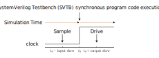

## SystemVerilog Verification Environment

### Well Designed Verification Environment

Test Environment must:

- Be structure for Debug
- Avoid false positives

Test must:

- Achieve Functional Coverage
  - Prevent untested regions
- Reach Corner Cases
  - Anticipated Cases
  - Error Injection
    - Environment Error
    - DUT Error
  - Unanticipated Cases
    - Random Tests
- Be robust, reusable, scalable

### SystemVerilog Test Environment

<div style="text-align: center;">
  
</div>

### SystemVerilog - Key Features

SystemVerilog introduces two new design units

- The `program` block (**NOT RECOMMENDED TO USE**)
  - Use `module` instead
  - Is where you develop testbench code
  - Is entry point for testbench execution
- The `interface`
  - Is mechanism to connect testbench to DUT
  - Is a named bundle of wires
  - Can be passed just like a port in a port list

SystemVerilog testbenches uses Object Oriented Programming (OOP)

- Uses `class` definition

### Program Block - Encapsulate Test Code

The `program` block provides

- Entry point to test execution
- Scope for program-wide data and routines
- Race-free iteration between testbench and design

Develop test code in `program` code

- Can also use a `module` block

```verilog
// Optionally pass interface in port list
program automatic test(router_if.TB vif);
  initial begin
    run();
  end

  task run();
  ...
  endtask : run
endprogram : test
```

### Interface - Encapsulate Connectivity

An `interface` encapsulates the communication between DUT and testbench including

- Connectivity (signals) - name bundle of wires
  - One or more bundles to connect modules and tests
  - Can be reused for different tests and devices
- Directional information (`modports`)
- Timing (`clocking` blocks)
- Functionality (`task`, `function`, assertions, `initial/always` blocks)

Solves many problem with traditional connections

- Port list for he connections are compact
- Easy to add new connections
- Opportunity to pass DUT connections throughout the testbench (virtual interfaces)

### Comparing SystemVerilog Containers

| `module`           | `interface`        | `program`     | `class`       |
| ------------------ | ------------------ | ------------- | ------------- |
| modules intance    |                    |               |               |
| interface instance | interface instance |               |               |
| `clocking`         | `clocking`         | `clocking`    |               |
| `class`            | `class`            | `class`       | `class`       |
| object             | object             | object        | object        |
| `reg (logic)`      | `reg (logic)`      | `reg (logic)` | `reg (logic)` |
| variable           | variable           | variable      | variable      |
| `wire`             | `wire`             | `wire`        |               |
| `assign`           | `assign`           | `assign`      |               |
| `initial/always`   | `initial/always`   | `initial`     |               |
| `task`             | `task`             | `task`        | `task`        |
| `function`         | `function`         | `function`    | `function`    |

### Interface - An Example

The RTL code is connected with bundled signals

```verilog
module test(simple_bus sb);
...
endmodule
```

```verilog
module cpu(simple_bus sb);
...
endmodule
```

```verilog
interface simple_bus();
  logic req, gnt;
  logic [7:0] addr;
  wire  [7:0] data;
  logic [7:0] mode;
  logic start, rdy;
endinterface
```

```verilog
module top;
  logic clk = 0;
  always begin
    #10 clk = !clk;
    simple_bus sb(clk);
    test t1(sb);
    cpu c1(sb);
  end
endmodule
```

### Synchronous Timing: `clocking` Blocks

Are just for testbench

- Emulates the launch and captures flops at IO of DUT

Create explicit synchronous timing domains

- All signals driven or sampled at clocking event
  - By default all interface signals are asynchronous
- Interaction between testbench and DUT ideally happens only at clock edges (cycle-based)

Specify signal direction

- Outputs can not be sampled
- Input signals cannot be driven

Multiple clocking blocks supported

- Active driver
- Reactive driver
- Monitor

```verilog
clocking cb @(posedge clock);
  default input #1ns output #1ns;
  output reset_n;
  output din;
  output frame_n;
  output valid_n;
  input  dout;
  input  valido_n;
  input  busy_n;
  input  frameo_n;
endclocking : cb
```

### Signal Direction Using `modport`

Enforce signal access and direction with `modport`

```verilog
interface router_if (input logic clock);
  logic         reset_n;
  ...
  logic [15:0]  frameo_n;

  clocking cb @(posedge clock);
    default input #1ns output #1ns;
    output reset_n;
    ...
    input  frameo_n;
  endclocking : cb

  modport DUT(input reset_n, input din, output dout, ...);
  modport TB(clocking cb, output reset_n);
endinterface: router_if
```

```verilog
module test (router_if.TB vif);
  initial begin
    vif.reset_n = 'd0;
    vif.cb.frame_n <= '1;
    vif.cb.valid_n <= '1;
  end
endmodule : test
```

```verilog
module router (router_if.DUT vif, input logic clock);
...
endmodule : router
```

### A complete `interface`

```verilog
interface router_if (input logic clock);
  // Named bundle of asynchronous signals
  logic         reset_n;
  logic [15:0]  din;
  logic [15:0]  frame_n;
  logic [15:0]  valid_n;
  logic [15:0]  dout;
  logic [15:0]  valido_n;
  logic [15:0]  busy_n;
  logic [15:0]  frameo_n;

  // Create synchronous behavior by placing into `clocking` block
  clocking cb @(posedge clock);
    default input #1ns output #1ns;  // Sample and drive skews
    output reset_n;
    output din;
    output frame_n;
    output valid_n;
    input  dout;
    input  valido_n;
    input  busy_n;
    input  frameo_n;
  endclocking : cb

  // Defines access and direction with modport
  modport TB(clocking cb, output reset_n);  // Synchronous and Asynchronous behavior
endinterface: router_if
```

### Driving and Samplign DUT Signals

DUT signals are driven in the device driver

DUT signals are sampled in the device monitor

### SystemVerilog Testbench Timing

Clocking clock emulates synchronous drives and samples

- Driving and sampling events occur at clocking event

<div style="text-align: center;">
  
</div>

$$
\begin{array}{lll}
\text{Sample} & = & t_{0} - \text{Input Skew} \\
\text{Drive}  & = & t_{0} + \text{Output Skew}
\end{array}
$$

### Input and Output Skews

<div style="text-align: center;">
  
</div>

Output Skew is the `clk2q` delay of the launch flop for the DUT input

- Defaults to `#0`

Input Skew is the `setup` time of the capture flop for the DUT output

- Defaults to `#1step` - preponed region of simulation step

### SystemVerilog Scheduling

Each time slot is divided into 5 major regions

- `Preponed` Sample signal before any changed (`1#step`)
- `Active` Design simulation (`modules`), including NBA (Non-Blocking Assignments)
- `Observed` Assertions evaluated after design executes
- `Reactive` Testbench activity (`program`)
- `Postponed` Read only phase

| Region      | Activity   |
| ----------- | ---------- |
| `Preponed`  | sample     |
| `Active`    | design     |
| `Observed`  | assertions |
| `Reactive`  | testbench  |
| `Postponed` | `$monitor` |

### Synchronous Drive Statements

```verilog
interface.cb.signal <= <values|expression>;
```

Drive must be non-blocking

Driving of input signals is not allowed

Example:

```verilog
vif.cb.din[3] <= var_a;
```

```verilog
vif.cb.din[3]  = 1'b1;  // Error because blocking
vif.cb.dout[3] <= 1'b1; // Error because output
vif.dout[3]    <= 1'b1; // Error because missing cb
```

### Sampling Synchronous Signals

```verilog
variable = interface.cb.signal;
```

Variable is assigned the sampled value

- Value that the clocking clock sampled at the most recent clocking event

Avoid non-blocking assignment

Sampling of output signal is not allowed

Example:

```verilog
data[i]  = vif.cb.dout[7];
all_data = vif.cb.dout;
frm_out  = vif.framo_n[7];           // Error missing cb
$display("din = %b/n", vif.cb.din);  // Error because input
```

### Using Interface in Program

```verilog
// Pass modport as port list
program automatic test(router_if.TB vif);
  initial begin
    reset();
  end

  task reset();
    vif.reset_n = 1'b0;          // Asynchronous signals are driven without reference to clocking block
    vif.cb.frame_n <= 16'hffff;  // Synchronous signals are referenced via clocking block
    vif.cb.valid_n <= ~('b0);
    repeat(2) @(vif.cb);
    vif.cb.reset_n <= 1'b1;
    repeat(15) @(vif.cb);        // Advance clock cycles via clocking block
  endtask

endprogram: test
```

### Complete Top-Level Harness

Instantiate test program and interface in harness file

```verilog
// Legacy DUT (wires)
module router(
  reset_n, din, frame_n, valid_n, dout,
  valido_n, busy_n, frameo_n
);
...
endmodule
```

```verilog
module router_test_top;
  parameter simulation_cycle = 100;
  bit SystemClock;

  // Instantiate interface
  router_if vif(SystemClock);    // Connect SystemCLock to interface block

  // Instantiate test program
  test router_test(vif)

  // Instantiate DUT using interface connection
  router dut(
    .reset_n   (vif.reset_n),
    .din       (vif.din),
    .frame_n   (vif.frame_n),
    .valid_n   (vif.valid_n),
    .dout      (vif.dout),
    .valido_n  (vif.valido_n),
    .busy_n    (vif.busy_n),
    .frameo_n  (vif.frameo_n)
  );

endmodule
```

### Compile RTL and Simulate with VCS

Compile HDL code: (generate `simv` simulation binary)

```plain
top_test.sv    // Test code
router_if.sv   // Interface
tb.sv          // Harness
router.sv      // RTL
```

This is the basic way to compile and simulate:

```plain
vcs -sverilog -debug_access+all tb.sv test.sv router_if.sv router.v
```

```plain
./simv
```

But it is recommended to use a Makefile instead:

```makefile
ROOT_DIR := $(CURDIR)
CUR_DATE := $(shell date +%Y-%m-%d_%H-%M-%S)
RUN_DIR := $(CURDIR)/work

SEED ?= 1
PLUS ?=

RTL_PATH = $(abspath $(ROOT_DIR)/../rtl)
RTL_FILES = $(RTL_PATH)/router.v
SVE = -F $(ROOT_DIR)/sve.f
FILES = $(RTL_FILES) $(SVE)

VCS = vcs -full64 -sverilog \
   -lca -debug_access+all -kdb +vcs+vcdpluson \
   -timescale=1ns/100ps $(FILES) -l comp.log \
   -top tb

SIM_OPTS = -l simv.log \
            +$(PLUS)

.PHONY: compile clean help

all: help

compile:
 @mkdir -p $(RUN_DIR)/sim
 cd $(RUN_DIR)/sim && $(VCS)

sim:
 cd $(RUN_DIR)/sim && ./simv +ntb_random_seed=${SEED} $(SIM_OPTS)

random:
 cd $(RUN_DIR)/sim && ./simv +ntb_random_seed_automatic $(SIM_OPTS)

verdi:
 cd $(RUN_DIR)/sim && verdi -dbdir ./simv.daidir -ssf ./novas.fsdb -nologo &

clean:
 rm -rf $(RUN_DIR)

help:
 @echo ""
 @echo "=================================================================="
 @echo ""
 @echo "---------------------------- Targets -----------------------------"
 @echo " compile             : Runs compilation"
 @echo " sim                 : Runs simulation with default seed"
 @echo " random              : Runs simulation with random seed"
 @echo " clean               : Delete work/ directory"
 @echo "=================================================================="
 @echo ""
 @echo "--------------------------- Variables ----------------------------"
 @echo "  SEED                : Random seed used, must be an integer > 0"
 @echo "  PLUS                : Add extra flags in simv command"
 @echo ""
```

`sve.f` (Simulation Verification Environment) files

```plain
+incdir+tests
+incdir+tb
+incdir+sv
sv/router_if.sv
test/top_test.sv
tb/tb.sv
```

For more information about all the flags refer to [VCS/SIMV docs](vcs_simv_docs.md).

### SystemVerilog Run-Time Options

Pass values form simulation command line using `+argument`

Retrieve `+argument` value with `$value$plusargs()`

```verilog
initial begin : proc_user_args
  int value;
  if ($value$plusargs("custom=%d", value)) begin
    $display("The value is: %2d", value);
  end else begin
    $display("Using default seed");
  end
end : proc_user_args
```

```plain
./simv +custom=10
```

Create your own argument options for simulation control and debug
