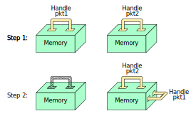

# SystemVerilog notes

## Acronyms

LRM -> Language Reference Manual

## SystemVerilog Verification Environment

## SystemVerilog Language Basics - 1

## SystemVerilog Language Basics - 2

## Concurrency

## Object Oriented Programming (OOP) - Encapsulation

### Abstraction Enhances Re-Usability of Code

Some common objects that you can reuse across multiple projects are:

- Generator
- Transactor
- Driver
- Monitor

and so on

### SystemVerilog OOP Program Constructs

Building SystemVerilog OOP structure is similar to building Verilog RTL structure

|                  | RTL                                                         | OOP                              |
| ---------------- | ----------------------------------------------------------- | -------------------------------- |
| Block definition | `module`                                                    | `class`                          |
| Block instance   | instance                                                    | object                           |
| Block name       | instance name                                               | object handle                    |
| Data types       | registers and wires                                         | variables                        |
| Functionality    | `task`, `function`, behavioral blocks (`always`, `initial`) | subroutines (`task`, `function`) |

Unlike in a `module`, nothing executes automatically in an object. Some subroutine in the object mst be called to perform an action.

### OOP Encapsulation (OOP Class)

Similar to a `module`, an OOP `class` encapsulates:

- Variables (properties) used to model a system
- Subroutines (methods) to manipulate the data
- Properties and methods are called members of class
- Class properties and methods are visible inside the class

```verilog
class Packet;
  // Packet properties
  string   name;
  bit[3:0] sa, da;
  bit[7:0] payload[];

  // Packet methods
  task send();
    send_addrs();
    send_pad();
    send_payload();
  endtask : send

  task send_addrs();   ... endtask
  task send_pad();     ... endtask
  task send_payload(); ... endtask
endclass : Packet
```

### `module` vs `class`

Why use `class`?

- Objects are dynamic, modules are static
  - Objects are created and destroyed as needed
- Instances of modules can not be passed, copied or compared
  - Instances of classes are objects
  - A handle points to an object (class instance)
  - Object handles can be passed as arguments
  - Objects memory can be copied or compared
- Classes can be inherited, modules can not
  - Classes can be modified via inheritance without impacting existing users
  - Modifications to modules will impact all existing users

### Constructing OOP Objects

OOP objects are constructed from `class` definitions

- Similar to instance creation from `module` definition

Object memory is constructed by calling `new()`

- Handle used to refer to object

```verilog
class Packet;
  bit[3:0] sa, da;
  byte payload[];
  task send();
endclass : Packet
```

```verilog
module test;
  Packet pkt1 = new();
  Packet pkt2;       // This is a handle
  Packet pkt3;
  initial begin
    pkt3 = new();
    pkt2.sa = 3;      // Runtime Error
  end
endmodule
```

<div style="text-align: center;">
  
</div>

### Accessing Object Members

Object members are accessed using the object handle

- Similar to accessing RTL instance signals and subroutines
- Accessed via dot (.) notation

```verilog
module test;
  class Packet;
    bit[3:0] sa, da;
    byte payload[];
    task send();
  endclass : Packet

  Packet pkt;
  initial begin
    pkt = new();
    pkt.sa = 3;  // access property
    pkt.da = 7;  // access property
    pkt.send();  // access method
  end
endmodule
```

### Initialization of Object Properties

Define constructor `new()` in class to initialize properties

- No return type in declaration
- Executes immediately after object memory is allocated
- Not accessible via dot (.) notation

The constructor should

- Allocate memory
- Initialize variables
- Nothing else!

If constructor `new()` is not defined a default is provided

```verilog
module test;

  class Packet;
    bit[3:0] sa, da;
    bit[7:0] payload[];
    function new(bit[3:0] init_sa, init_da, int init_payload_size);
      sa = init_sa;
      da = init_da;
      payload = new[init_payload_size];
    endfunction : new
  endclass : Packet

  initial begin
    Packet pkt1 = new(3, 7, 2);
    pkt1.new(5, 8, 3);          // Syntax error!
  end

endmodule
```

### Initialization of Object Properties: `this`

`this` keyword

- An object's handle to itself
- Unambiguously refer to `class` members of the current instance (object)
  - More readable - allows method arguments to have same name as `class` variables

```verilog
class Packet;
  bit[3:0] sa, da;
  bit[7:0] payload[];
  function new(bit[3:0] sa, da, int payload_size);
    this.sa = sa;
    this.da = da;
    this.payload = new[payload_size];
  endfunction : new

endclass : Packet
```

### OOP Data Hiding (Integrity of Data) (1/3)

Unrestricted access to object properties can cause unintentional data corruption

```verilog
class driver;
  int max_err_cnt = 0, err_cnt = 0;
  task run();
  ...
    if (error_cond()) begin
      err_cnt++;
    end
    if ( (max_err_cnt != 0) && (err_cnt >= max_err_cnt) ) begin
      $finish;
    end
  endtask
  function new();  .... endfunction
endclass : driver
```

```verilog
module test();
  initial begin
    driver drv = new();
    drv.max_err_cnt = -1;  // directly set max_err_cnt
    drv.run();             // Will this work?
  end
endmodule
```

`max_err_cnt` should not be able to be `-1`;

### OOP Data Hiding (Integrity of Data) (2/3)

Properties and methods can be protected using `local` or `protected`

- Object members are `public` by default
- `local` members of object can be accessed only in the class (base), like routines, they can not be access externally or by an extended class
- `protected` members can be access by subclasses (extended from base) and also by base class

```verilog
module test;
  class driver;
    local int max_err_cnt = 0;
    protected err_cnt = 0;
    task run(); ... endtask
  endclass : driver

  initial begin
    driver drv = new();
    drv.max_err_cnt = -1;    // Compile error!
    drv.run();
  end
endmodule
```

### OOP Data Hiding (Integrity of Data) (3/3)

Create public `class` method to allow users to access `local` members

- Ensure data integrity within the method

```verilog
class driver;
  local int max_err_cnt = 0, err_cnt = ;
  task run(); ... endtask
  function set_max_error_cnt(int max_err_cnt);
    if(max_err_cnt < 0>) begin  // Ensure integrity of object data
      this.max_err_cnt = 0;
      return;
    end else begin
      this.max_err_cnt = max_err_cnt;
    end
  endfunction
endclass : driver
```

```verilog
module test;
  initial begin
    driver drv = new();
    drv.set_max_err_cnt(-1);    // No Compile error!
    drv.run();
  end
endmodule
```

### Working with Objects - Handle Assignment

What happens when one object handle is assigned to another?

Like any variable, the target takes on the value of the source.

```verilog
class Packet;
  int payload_size;
  ...
endclass : Packet

Packet pkt1 = new();
Packet pkt2 = new();

pkt1 = pkt2;             // handle copy, not object copy
pkt1.payload_size = 5;   // whose payload_size is set?
```

What happens to the `pkt1` object memory?

<div style="text-align: center;">
  
</div>

Object handles are similar to pointers. The handle points to a specific space in memory. So the answer is that `pkt1` memory is gets clean up by the simulator and that memory is free to be use for something else, this is the garbage collector

### Working with Objects - Garbage Collection

VCS garbage collector reclaims memory automatically

- When an object memory is no longer accessible
- Object has no schedule event

Object can be manually dereference using

```verilog
pkt1 = null;
```

Making an exact duplicate of object memory:

```verilog
class Packet;
  int count;
  Payload p:             // Encapsulated object
endclass: Packet
...
Packet pkt1 = new();
Packet pkt1_copy;        // handle only
pkt1.p = new();

// construct pk1_copy and
// copy contents of pkt1 to pkt1_copy

pkt1_copy = new pkt1;     // Do not do this
// shallow copy
// (encapsulated objects not copied)
// They both have the same point to Payload p
// object pkt1 must exist
```

This method of copying is not recommended.
Normally every class that needs it should provide a `copy()` method

```verilog
pkt1_copy = pkt1.copy();
```

### Working with Objects - `static` Members

Variables and subroutines can be defines using `static` keyword

- Associated with the class, not object
- Shared by all objects of that class
- Can be accessed using `class_name::`
- Can be accessed also using `handle.<static_variable>`

Static subroutines

- Can only access `static` members
- Can not be `virtual`

Static members are allocated and initialized at compile

```verilog
module test;
  initial begin
    Packet pkt0 = new();
    Packet pkt1 = new();
    $display("pkt0 id is: %0d", pkt0.id);
    $display("pkt1 id is: %0d", pkt1.id);
    $display("count: %0d", Packet::count);
  end
endmodule
```

```verilog
class Packet;
  static int count = 0;
  int id;

  static function int get_count();
    return count;
  endfunction

  function new();
    this.id = count++;
  endfunction
endclass : Packet
```

### Working with Objects - `const` Properties

Use `const` keyword to define constant properties that can not be modified

- Global constant - typically also declared `static`
- Instance constant - can not be `static`

```verilog
class Packet;
  static int count = 0;
  const int id;                             // Instance constant

  static const string type_name = "Packet"; // Global constant

  function new();
    this.id = count++;                      // Instance constant can only be assigned in new()
  endfunction
endclass : Packet
```

```verilog
module test;
  initial begin
    Packet pkt0 = new();
    pkt0.id = 0;                   // Compile error - can not change const property
    pkt0.type_name = "newPacket";  // Compile error
  end
endmodule
```

### Working with Objects - Array Methods

```verilog
class Packet;
  rand bit [7:0] payload[];   // Data
  rand bit [2:0] pr;          // User-defined Priority 0-7
  rand bit [2:0] addr;        // Address
endclass : Packet

Packet pq[$];                 // Queue of packet handles
initial begin
  int len;

  generate_packet_queue(pq);  // Some user-defined method
  // Sort objects using user-defined priority property in class
  pq.sort(pkt) with (pkt.pr); // pkt is user-defined, auto-declared iterator
  // Find total length of all payloads - item is default iterator
  len = pq.sum() with (item.payload.size());
end
```

### Working with Objects - Concurrency

Classes can not have initial or `always` blocks

Spawn a process similar to an `always` block with `fork-join_none`

Standard methodology

- Test call `run()` method of the various OOP testbench components
  - Generator, Monitor, Driver, Scoreboard, etc

```verilog
class Driver;
...
task run();       // Thread start method
  fork
    forever begin
      send();
    end
  join_none
endtask : run

endclass : Driver
```

### Parameterized Classes

Written for generic types and/or values

- Parameters passed at instantiation, just like parameterized modules
- Allows reuse of common code

```verilog
module test;
  int_stack addr_stack;
  Packet_stack data_stack;

  initial begin
  ...
    repeat(addr_stack.size()) begin
      Packet pkt = new();
      if (!pkt.randomize()) begin
        $finish;
      end
      pkt.addr = addr_stack.pop();
      data_stack.push(pkt);
    end
  end
endmodule
```

```verilog
class int_stack;
  protected int items[$];
  function void push(int a);
  ...
  function int pop();
  function int size();
endclass : stack
```

```verilog
class stack #(type T = int, bit[11:0] depth = 1024);
  protected T items[$:depth];
  function void push(T a);
  ...
  function T pop();
  function int size();
endclass : stack
```

```verilog
module test;
  stack addr_stack;  // Default type
  stack #(Packet, 128);

  initial begin
  ...
    repeat(addr_stack.size()) begin
      Packet pkt = new();
      if (!pkt.randomize()) begin
        $finish;
      end
      pkt.addr = addr_stack.pop();
      data_stack.push(pkt);
    end
  end
endmodule
```

`type` is a keyword and `T` is the placeholder name of the type of variable.

### Forward `typedef`

A forward `typedef`

- Is needed to use a class before declaration
  - e.g. two classes need handle to each other
    Can be used for many data typeCan be used for many data types

Use a `typedef` to make a forward reference, the problem we are trying to solve is what happens when two classes reference each other? Which one do we declare first?

With `typedef` we are telling the compiler that while at the time of compiling `Packet` seems to be undefined it is going to be define it before leaving the file. This solves the problem of circular reference.

```verilog
typedef class Packet;
class Generator;
  Packet p1;            // This is a compile error is typedef is missing
  function new();
    p1 = new();
    p1.mygen = this;
  endfunction
endclass : Generator

class Packet;
  bit[7:0] sa, da, payload[$];
  Generator mygen;
endclass : Packet
```

### Best Practices (1/2)

Placed class methods outside of the `class` definition

- Inside `class` block, associate the method with its class
- Outside `class` block, associate the method with its class
  - Use double-colon :: (a scope/name resolution operator)

```verilog
class node;
  static int count = 0;
  string str;
  node next;
  ...
  task ping();
  ...
  endtask : ping
endclass : node
```

```verilog
class node;
  static int count = 0;
  string str;
  node next;
  ...
  extern task ping();  // Prototype
endclass : node

task node::ping();     // Place class name and double-colon before method name
...
endtask : ping
```

### Best Practices (2/2)

Create useful methods for data classes (user defined)

- `display()`

  - Print object variables to console - helpful for debugging

- `compare()`

  - Return match, mismatch, other status based by comparing object variables to variables of another object
  - Simplifies self-check

- `copy()`
  - Copy selected variables or nested objects
  - Allows you to do deep copy if required

Use `typedef` to create shortcuts

- `typedef stack#(Packet) pkt_stack`
  - Now use `pkt_stack` instead of `stack#(Packet)`

### Virtual Interfaces

Classes need to drive/sample signals of interface

- Interfaces can not be created at object construction. Need to create a `virtual` reference to interface

```verilog
class Driver;
  virtual router_if.TB vif;              // Create virtual reference to interface
  ...
  function new(virtual router_if.TB vif) // Pass virtual connections via constructor argument
    this.vif = vif;
  endfunction : new

  task send_addr();
    this.vif.cb.frame_n[sa] <= 1'b0;    // Drive/Sample signals using virtual interface
    for (int i = 0; i < 4; i++) begin
      this.vif.cb.din[sa] <= da[i];
      @(this.vif.cb);
    end
  endtask: send_addr
endclass : Driver
```

### SystemVerilog Packages

Package is a mechanism for sharing among modules, programs, interfaces and other packages:

- Parameters
- Data - variables and nets
- Type definitions
- Tasks and functions
- Sequence and property declarations
- Classes

Declarations may be referenced within modules, interfaces, programs and other packages

### Packages: Example

```verilog
package ComplexPkg:
  class Complex;
    float i, r;
    extern virtual task display();
    ...
  endclass : Complex

  function automatic Complex add(Complex a, Complex b);
    add = new();
    add.r = a.r + b.r;
    add.i = a.i + b.i;
  endfunction : add

  function automatic Complex mul(Complex a, Complex b);
    mul = new();
    mul.r = (a.r * b.r) - (a.i * b.i);
    mul.i = (a.r * b.i) + (a.i * b.r);
  endfunction : mul
endpackage : ComplexPkg
```

Task and Functions inside a package are `static` by default, for that reason the `automatic` keyword is necessary

### Rules Governing Packages

Packages are explicitly named scopes appearing at the outermost level of the source text (at the same level as top-level modules as primitives)

Packages must not contain any processes

- Wire declarations with implicit continuous assignments are not allowed

Packages can not gave hierarchical references

> Note: Subroutines defined in a `package` are `static` unless explicitly made `automatic`. Classes are always `automatic`

### Using Packages

Directly reference package member using class scope resolution operator `::`

```verilog
ComplexPkg::Complex cout = ComplexPkg::mul(a,b);
```

`import` package into appropriate scope

- Explicit import of specific symbols
  - `import ComplexPkg::Complex;`
  - `import ComplexPkg::add;`
- Implicit import of all symbols in package
  - `import ComplexPkg::*`
  - Now all symbols in `ComplexPkg` are visible
- OK to import same package in multiple locations
  - `include` cannot be used in multiple places

### Using Packages: Example (1/2)

```verilog
// Implicit import all symbols
module dut(if.dut_port dut_io);
  import ComplexPkg::*;         // Import whole package
  Complex l,m,n;
endmodule : dut
```

```verilog
// Import of specific symbol
module test(if.tb_port tb_io);
  import ComplexPkg::Complex;  // Import specific symbols
  ...
endmodule : test
```

```verilog
// Direct reference
class harmonix;
  ComplexPkg::Complex i,j;    // Direct reference using ::
  ...
endclass : harmonix
```

### Using Packages: Example (2/2)

Packages can be imported by other packages

`export` allows a package imported by one package to be imported along with the importing package

- `export` follows same syntax as `import`

```verilog
package signal_analysis;
  import ComplexPkg::*;
  // Export with signal_analysis
  export ComplexPkg::*;
  class harmonix;
    Complex alpha, beta, gamma;
  endclass : harmonix
endpackage: signal_analysis
```

### OOP: Quiz 1

1. What will the program display?

- The value of `o1.a = 10` because the `a` changing in the constructor is the one inside the function

2. Did it display what you expected?

- No

3. How will you fix this?

- Using `this` operator

```verilog
module test1;
  class abc;
    int a = 10;
    function new(int a);
      a = a;
    endfunction
  endclass

  abc o1;
  initial begin
    o1 = new(5);
    $display("a = %0d", o1.a);
  end
endmodule
```

### OOP: Quiz 2

1. What will the program display?
2. Why?

```verilog
module test1;
  class abc;
    int a = 10;
  endclass

  initial begin
    abc o1 = new();
    abc o1 = new();

    o1.a = 5;
    o2.a = 50;
    $display("a = %0d", o1.a);
  end
endmodule
```

### Alternatives to Exhaustive Testing?

32-bit adder example: Assume one set of input and output ca be verifies every 1ns.
How long will exhaustive testing take?

What if exhaustive testing is unachievable?

- Answer: Verify design with a sufficient set of vectors to gain a level of confidence that product will ship with a tolerable field-failure rate

Best known mechanism is randomization of data combined with functional coverage

### Process of Reaching Verification Goals

<div style="text-align: center;">
  
</div>

### OOP Based Randomization

In SystemVerilog, randomization is achieved via classes

- `randomize()` function is built into every class

Two types of random properties are supported:

- `rand` - Values can repeat without exhausting all possible values
  - Think "rolling dice"
- `randc` Exhaust all values before repeating any value
  - Think "picking a card from a deck of cards"
  - Can be as large as 32-bits in VCS

When the class function `randomize()` is called:

- Randomizes each `rand` and `randc` property value
  - To full range of its data type if no constraints specified

When the class `randomize()` function is called, if there are no constrains in the variables it will produce a random answer all equally possible.

`rand` and `randc` are not solve at the same time together, all `rand` variables are solve together and all `randc` variables are solve together.

### Randomization Example

```verilog
class Packet;
  randc bit[3:0] sa, da;           // Declare random properties in class
  rand  bit[7:0] payload[];

  function Packet copy(...);
  ...
  endfunction : copy
endclass: Packet
```

```verilog
module test;
  int run_for_n_pkts = 100;
  Packet pkt = new();              // Construct an object to be randomized
  initial begin
    ...
    repeat(run_for_n_pkts) begin
      if (!pkt.randomize()) begin  // Randomize content of object
        fork
          send();
          secv();
        join
        check();
      end
    end
  end
endmodule : test
```

It is always a good idea to check if the `randomize()` function was successful

### Controlling Random Variables (1/2)

How do you control the value range for `sa` and `da`?

How do you control the size of `payload[]`

```verilog
class Packet;
  randc bit[3:0] sa, da;
  rand  bit[7:0] payload[];
  function void display();
    $display("sa = %0d, da = %0d", sa, da);
    $display("size of payload array = %0d", payload.size());
    $display("payload[]", payload);
  endfunction : display
endclass : Packet
```

```verilog
module test;
  Packet pkt = new();
  if (!pkt.randomize()) begin
    $finish;
  end
  pkt.display();
endmodule : test
```

### Controlling Random Variables (2/2)

Randomization can be controlled using `constraint` block

```verilog
class Packet;
  randc bit[3:0] sa, da;
  rand  bit[7:0] payload[];
  constraint corner_test {
    sa == 12;                    // Equality operator, not assignment
    da inside {2,4,[16:10]};     // Set membership
    payload.size() >= 2;         // Array aggregate
    payload.size() <= 4;
  }
endclass : Packet
constraint valid {...};
```

- Constraint support only 2-state values;
- Multiple `constraint` blocks may be defined is same class
- Constraint expressions are describing a relationship not an assignment

```verilog
constraint single_sa { sa = 12;}      // Syntax error
```

### SystemVerilog Constraints

Relational Operators

```verilog
constraint single_sa {
  sa == 12;
  da < sa;
}
```

Set Membership

- Select from a list or set with keyword inside

```verilog
constraint Limit1 {
  sa inside {[5:7], 10, 15};  // 5,6,7,10,15 equally weighted probability
}
```

- Exclude from a specified set with `!`

```verilog
constraint Limit2 {
  !( sa inside {[1:10], 15} );  // 0,11,12,13,14 equally weighted probability
}
```

### Weighted Constraints

Constraint values can also be weighted over a specified range using keyword `dist` and:

- `:=` (apply the same wight to all values in range)

```verilog
constraint Limit {                 // equal weights
  sa dist {[5:7] := 30, 9 := 20};  // 5,6,7 equally weight of 30 each, 9 has a weight of 20
}
```

- `:/` (divide the wight among all values in range)

```verilog
constraint Limit {                 // divided weights
  sa dist {[5:7] :/ 30, 9 := 20};  // 5,6,7 equally weight of 10 each, 9 has a weight of 20
}
```

### Array Constraint Support

Members can be constrained within `foreach` loop

Aggregates can be used to constrain arrays

- `size()`, `sum()` and more

Set membership can be used to reference content

```verilog
class Config:
  rand bit[7:0] addrs[10];
  rand bit drivers_in_use[16];
  rand int num_of_drivers, one_addr;

  constraint limit {
    num_of_drivers inside { [1:16] };
    drivers_in_use.sum() with (int'(item)) == num_of_drivers;
    foreach (addrs[idx]) (idx > 0) -> addrs[idx] > addrs[idx-1]
    one_addr inside addrs;
  }
endclass : Config
```

### Implication and Order Constraints

`->` (Implication Operator)

- `if (...) [else ...]` also available
- Caution: does not imp0ly solving order

```verilog
typedef enum {low, mid, high, any} AddrTyp_e;
class MyBus;
  rand bit[7:0]  addr;
  rand AddrTyp_e atype;
  constraint addr_range {
    (atype == low)  -> addr inside { [0:15] };
    (atype == mid)  -> addr inside { [16:127] };
    (atype == high) -> addr inside { [128:255] };
  //  if     (atype == low)  addr inside { [0:15] };
  //  elseif (atype == mid)  addr inside { [16:127] };
  //  elseif (atype == high)  addr inside { [128:255] };
  }
endclass : MyBus
```

### Equivalence Constraints

Use `<->` (Equivalence operator) to define a true bidirectional constraint

- `A <-> B` means if A is true B must be true and if B is true A must be true
- Caution: does not imply solving order

```verilog
typedef enum {low, mid, high, any} AddrTyp_e;
class MyBus;
  rand bit[7:0]  addr;
  rand AddrTyp_e atype;
  constraint addr_range {
    (atype == low)  <-> addr inside { [0:15] };
    (atype == mid)  <-> addr inside { [16:127] };
    (atype == high) <-> addr inside { [128:255] };
  }
endclass : MyBus
```

### Uniqueness Constraints

Constraint each variable in a group to be `unique` after randomization

```verilog
class C;
  rand bit [2:0] a [7];
  rand bit [2:0] b;
  constraint cst1 {
    unique { a[0:2], a[6], b}     // Array slices allowed
  }
endclass : C

C c_obj = new();
if (!c_obj.randomize()) begin
  $finish;
end

$display("a = ", c_obj.a);     // a = {h5, h0, h3, h1, h7, h2, h2}
$display("b = ", c_obj.b);     // b = 6
```

### System Functions

Bit-Vector system functions can be used in constraint (VCS only)

- Treated as an operator/expression instead of a function
  - `$countbits`
  - `$countones`
  - `$onehot`
  - `$onehot0`
  - `$bits`

```verilog
rand bit[3:0] vector;
constraint cst { $countones(vector) == 2;}

// same as
constraint cst {
  (vector[0] + vector[1] + vector[2] + vector[3] ) == 2;
}
```

### User-defined Functions in Constraints

User-defined functions can be used to constrain variables

- See LRM for rules and limitations on functions and randomization order
- Can also use C functions using DPI

```verilog
class D;
  rand bit [6:0]  a,b;
  rand bit [7:0]  c;
  constraint c0 { c == add(a,b); }

  function bit[7:0] add (input bit[6:0] i1, i2);
    return (i1 + i2);
  endfunction : add
endclass : D
```

### Randomizing Real numbers

Limited support for randomization of ral variables (VCS only)

- Starting with the VCS 2017.12 release you can randomize variables of type
  `real`, `shortreat`, `realtime`
- Requires the `-xlrm floating_pnt_constraint` compiler switch
- Only one constraint per real variable allowed
- Only one real variable per constraint allowed
- Can only be constrained by constants or non-random state variables

```verilog
class cls;
  rand int       ix;
  rand real      rx;
  rand shortreal sx;
  rand shortreal tx;

  constraint t { tx dist { [0.02:0.20] :/30, [0.1:1.0] :/ 70 }; }
  constraint s { sx dist { [0.04:0.40] :/50, [0.1:1.0] :/ 50 }; }
  constraint s { rx dist { [0.01:0.10] :/10, [0.1:1.0] :/ 90 };
                 ix inside {[5:10]}; }

endclass : cls
```

### Constraint Solver Order

By default the simulator randomizes variables in any order it can in order to get a valid solution. To address this we can use:

`solve-before` construct set solving order for `rand` properties

- `randc` properties are always solved before `rand properties

  - Can not force `rand` to be randomized before `randc` properties

- `$void` (rand_property) solves `rand_property` first (VCS only)
- If the randomize function can not come up with a valid solution then if will solve with in another way.

```verilog
class MyBus;
  rand bit flag;
  rand bit[11:0] addr;
  constraint addr_range {
    if (flag == 0) begin
      addr = 0;
    end else begin
      addr inside { [1:1024] };
    end
    solve flag before addr;     // Guidance only
  }
endclass :
```

### Inline Constraints

Individual invocations of `randomize()` can be customized using

```verilog
obj.randomize() with { <additional constraints> }
```

```verilog
module test;
  class demo;
    rand int x, y, z;
    constraint Limit1 { x > 0; x <= 5; }
    ...
  endclass : demo

  initial begin
    demo obj_a = new();
    // ADD another constraint. Does NOT override Limit1
    if (!obj_a.randomize() with { x > 3 && x < 10;} ) begin
      $display("ERROR while randomize()");
    end
  end
endmodule : test
```

All constraints are merged.

### Soft Constraints

Use keyword `soft` when defining soft constraints

- Only for `rand` variables
- Not for `randc` variables

```verilog
class A;
  rand bit [7:0] x;
  constraint A1 { soft x == 6;}
endclass
```

Soft constraints are satisfied unless contradicted

- By a hard constraint
- By a soft constraint with higher priority

```verilog
A a = new();
initial begin
  a.randomize() with { x inside {[0:7]}; }   // x = 6
  a.randomize() with { x inside {[0:4]}; }   // 0 <= x <= 4
end
```

### Where are Soft Constraints Used?

In environment classes: to specify default ranges of random variables

In test program: to bias ranges in test

```verilog
class Packet;
  rand bit[11:0] len;
  rand int       min, max;
  constraint len_c { soft len inside {[min:max]} }
  constraint range { soft min == 0; soft max = 10; }
endclass

Packet p, q;
int tmin, tmax
// Override class constraints with higher priority constraints
stat = p.randomize() with {
  soft len inside {[tmin:tmax]}
}
// or change the object's min and max with hard constraints
stat = q.randomize() with {min==tmin; max==tmax;}
```

### Mutually Constrained Random Variables

Constraint limits can be random variables

```verilog
class demo:
  rand bit[7:0] high;
  rand int unsigned x;
  constraint Limit {
    x > 1;
    x < high;
  }
endclass : demo
```

What random values are generated for variable `high`?

- `randomize()` will eliminate values `{0,1,2}` for possible values for high
- If there is no legal value for high, then `randomize()` function prints warning and returns a 0. The properties are left unchanged
- Caution: does not imply solve order

### Inconsistent Constraints

What if the constraints cannot be solved by `randomize()`?

- It leaves the object unchanged and return a status value of 0
  - Simulation does not stop
- It produces this simulation error

```plain
Solver failed when solving following set of constraints
rand bit[31:0] x;       // rand_mode = ON
rand bit[7:0]  high;    // rand_mode = ON
constraint Limit{       // (from this) (constraint_mode = ON) (demo.sv:4)
  (x > 1000);
  (x <= high);
}
```

```verilog
class demo:
  rand bit[7:0] high;
  rand int unsigned x;
  constraint Limit {
    x > 1000;
    x <= high;
  }
endclass : demo
```

### Effects of Calling `randomize()`

When `randomize()` executes, three events occur:

- `pre_randomize()` is called
- Variables are randomizes
- `post_randomize()` is called

`pre_randomize()` (Optional)

- Set/Correct constraints
  - Example: `rand_mode(0|1)`

`post_randomize()` (Optional)

- Make changes after randomization
  - Example: `CRC

```verilog
class Packet;
  int test_mode;
  rand bit[3:0]  sa, da;
  rand bit[7:0]  payload[];
       bit[15:0] crc[];

  constraint LimitA {
    sa inside { [0:7] };
    da inside { [0:7] };
    payload.size() inside { [2:4] };
  };

  function void pre_randomize();
    if(test_mode) begin
      sa.rand_mode(0);
    end
  endfunction

  function void post_randomize();
    gen_crc();  // User method
  endfunction
endclass : Packet
```

### Controlling Randomization at Runtime

Turn randomization for properties on or off with:

```verilog
task/function int object_name.property.rand_mode( 1 | 0 );
```

- `1` - enable randomization (default)
- `0` - disable randomization
- If called as function, returns `rand_mode` state of property (0 or 1)

```verilog
class Node;
  rand int x, y, z;
  constraint Limit1 {
    x inside {[0:16]};
    y inside {[23:41]};
    z < y; z > x;
  }
endclass : Node
```

```verilog
module test;
  initial begin
    Node obj1 = new();
    obj1.x = 0;
    obj1.x.rand_mode(0);      // Solver still checks x satisfies its constraints
    if (!obj.randomize()) begin
    ...
    end
  end
endmodule : test
```

### Controlling Constraint at Runtime

Turn constraint blocks on and off with:

```verilog
task/function int object_name.constraint_block_name.constraint_mode( 1 | 0 );
```

- `1` - enable constraint (default)
- `0` - disable constraint
- If called as function, return state of constraint (0 or 1)

```verilog
class demo;
  rand int x, y, z;
  constraint no_error { x > 0; x <= 5; }
  static constraint with_err { x > 0; x <= 32;}
endclass : demo
```

```verilog
module test;
  initial begin
    demo obj_a = new();
    obj_a.no_error.constraint_mode(0);    // Test with errors
    if (!obj.randomize()) begin
    ...
    end
  end
endmodule : test
```

### Constraint Prototypes

Can define constraint prototypes in class using `extern`

- Define the constraint in same scope

```verilog
class demo;
  rand int x, y, z;
  extern constraint valid;      // must define
endclass : demo

// extern constraint must be defined later in same scope as class
constraint demo::valid { x > 0; y >= 0; z % x == 0; }
```

```verilog
module test_corner_case;
  `include "demo.sv"
  initial begin
    demo obj_a = new();
    if (!obj_a.randomize()) begin
    ...
    end
  end
endmodule : test_corner_case
```

### Nested Objects with Random Variables

`randomize()` follows a linked list of objects handles, randomizing each linked object to the end of the list

```verilog
class color;
  rand int hue, saturation, luminosity;
endclass : color

class pixel;
  rand color r, g, b
  ...
endclass : pixel
```

```verilog
module test;
  initial begin
    pixel px1 = new();
    px1.r = new();
    px1.g = new();
    px1.b = new();
    ...
    if (!px1.randomize()) begin // This will randomize objects px1 and px1.r, px1.g, px1.b
    ...
    end

  end
endmodule : test
```

### `std::randomize()`

`std::randomize()` for variables outside classes

- Very fast performance in VCS
- `std::` is optional

Available in `program`, `module`, `function` `task`, and `class`

- Randomization using `obj.randomize()` is still preferred

```verilog
module test;
  bit [11:0] addr;
  bit [5:0]  offset;
  function bit genConstrainAddrOffset();
    // Constraints using with keyword
    return std::randomize() with { addr > 1000; addr + offset < 2000; };
  endfunction
endmodule : test
```

### Changing the Random Seed at Simulation

Provide an initial seed for simulator with the following options (VCS)

- `ntb_random_seed = <initial_seed>`

  - `simv <other_opts> +ntb_random_seed = 123`

- `ntb_random_seed_automatic`
  - Unique initial seed, combining the time of day, hostname and process id
  - `simv <other_opts> +ntb_random_seed_automatic`

Seed appears in simulation log and coverage report

To query for the initial simulation seed use

- `$get_initial_random_seed();`

To save simulation log messages to a file use

- `simv <other_opts> -l simv.log`

### Object Oriented Programming: Inheritance

Object-oriented programming

- New classes derived from original (base or super) class
- New class inherits all contents of base class

```verilog
class BadPacket extends Packet;
  function void display();            // Inherited from Packet
  ...
  endfunction : display
  function bit[31:0] compute_crc();   // Inherited from Packet
  ...
  endfunction : compute_crc

  bit is_bad;
  function bit[31:0] compute_crc();   // Can override method of base class
    this.crc = super.compute_crc();   // Can call overridden behavior using super
    return(ctc = is_bad ? ~crc : crc);
  endfunction : compute_crc
endclass : BadPacket
```

`BadPacket` has access to `da`, `sa`, `data`, `crc` because it inherited from base class `packet`

New class is called _subclass_ or _extended_ or _derived_ class

Derived classes compatible with base class

- Can reuse code that uses the base class

```verilog
Packet pkt = new();
transmit(pkt);

BadPacket bad_pkt = new();
transmit(bad_pkt);            // Compatible

task transmit(Packet pkt);
  ...
  pkt.crc = pkt.compute_crc;
  ...
endtask : transmit
```

```verilog
pkt = bad_pkt;          // OK
bad_pkt = pkt;          // Error
$cast(bad_pkt, pkt);    // OK    Assign an extended class to a base class
```

<div style="text-align: center;">
  
</div>

### OOP Polymorphism

Which method gets called?

```verilog
class bad_packet extends packet;
  // pkt function
  function int compute_crc();
  ...
  endfunction
  // bad_packet function
  function int compute_crc();
  ...
  endfunction
endclass : bad_packet
```

Depends on

- Type of handle p (e.g. `packet` or `bad_packet`)
- Whether `compute_crc()` is `virtual` or not

If `compute_crc()` is not virtual - base class method is called

```verilog
Packet p = new();
BadPacket = bp = new();
p.crc = p.compute_crc();
bp.crc = bp.compute_crc();
transmit(p);
transmit(bp);

task transmit()
...
pkt.crc = pkt.comput_crc();  // Here there is a problem
...
endtask : transmit
```

The problem is that when the transmit function is called using `BadPacket` the `compute_crc()` method called is not the correct one, to fix this use the `virtual` keyword

If `compute_crc()` is virtual - overriding method is called

```verilog
class bad_packet extends packet;
  // pkt function
  virtual function int compute_crc();
  ...
  endfunction
  // bad_packet function
  // virtual not needed for derived classes but recommended
  virtual function int compute_crc();
  ...
  endfunction
endclass : bad_packet
```

### Polymorphism: Modify Constraints for Test Cases

Define test-specific constraint in derived classes

- Can also override existing constraints

```verilog
class data;
  rand bit[31:0] x, y;
  constraint valid {
    x > 0; y >= 0;
  }
endclass : data
```

```verilog
class Generator;
  data blueprint;
  ...
  while(...) begin
  ...
  blueprint.randomize();
  ...
  end
endclass : data
```

```verilog
module test_corner_case;
  class test_data extends data;
    constraint corner_case {
      x == 5; y == 10;
    }
  endclass : test_data

  initial begin
    test_data tdata = new();
    Generator gen = new();
    gen.blueprint = tdata;  // polymorphism
    ...
  end
endprogram : test_corner_case
```

Note that `gen.blueprint` is assign to a handle of a extended class of `data`, the only difference is that extended class `test_data` as different constraints has different constraints.

### Data Protection: `local`

`local` members of a base class are not accessible in the derived class

```verilog
class BadPacket extends Packet;
  // Packet
  local int DONE;
  function void display();
  ...
  endfunction : display

  function bit[31:0] compute_crc();
  ...
  endfunction : display

  // BadPacket
  function bit[31:0] compute_crc();
    this.crc = super.compute_crc();
    if ( is_bad ) crc = ~crc;
    DONE = 1'b1;                     // Error because is only accesible for base class
  endfunction : display
endclass : BadPacket
```

### Data Protection: `protected`

`protected` members of a base class are accessible in the derived class, but not to external code

```verilog
class BadPacket extends Packet;
  // Packet
  protected int DONE;
  function void display();
  ...
  endfunction : display

  function bit[31:0] compute_crc();
  ...
  endfunction : display

  // BadPacket
  function bit[31:0] compute_crc();
    this.crc = super.compute_crc();
    if ( is_bad ) crc = ~crc;
    DONE = 1'b1;                     // Good because it is accessible for derived classes
  endfunction : display
endclass : BadPacket
```

### Constructing Derived Class Objects

When constructing an object of a derived class

- If the derives class does not have a constructor a defined VCS inserts one

```verilog
function new();
  super.new();
endfunction
```

If the derived class defines a constructor a call to `new()` it must be the fist procedural statement

```verilog
super.new([args])
```

- Must use `super.new([...])`
- Must be called with the correct set of arguments
- If the call is missing, the compiler inserts one without arguments, as the first procedural statement of the function

```verilog
super.new()
```

### Taking a Closer Look: 1

Will the following code compile?

Which one of the task `new()` is executed?

```verilog
class A;
  protected int a;
  function int get_a();
    get_a = a;
  endfunction: get_a
  function new(int b);
    a = b;
  endfunction
endclass: A

class B extends A;
  protected int b = 1000;
  task print_a();
    $display("a is $d", get_a())
  endtask: print_a
endclass: A

class C extends B;
  function new(int c);
    a = c;
  endfunction
endclass: A

module test;
  C test_c = new(10);
  initial begin
    test_c.print_a();
  end
endmodule
```

### Taking a Closer Look: 1 (Answers)

VCS will attemp to execute every task `new()` starting with `new()` of class C, resulting in a syntax error

```verilog
class A;
  protected int a;
  function int get_a();
    get_a = a;
  endfunction: get_a
  function new(int b);
    a = b;
  endfunction
endclass: A

class B extends A;
  protected int b = 1000;
  task print_a();
    $display("a is $d", get_a())
  endtask: print_a
  // This is implicit
  function new();
    super.new();     // This calls class A with no args
  endfunction        // that is a Error: Mismatching argument list
endclass: A

class C extends B;
  function new(int c);
    super.new();     // This is implicit
    a = c;
  endfunction
endclass: A

module test;
  C test_c = new(10);
  initial begin
    test_c.print_a();
  end
endmodule
```

### Taking a Closer Look: 1 (Guideline)

Always call `super.new()` as the first procedural statement in constructor, with correct argument set

```verilog
class A;
  protected int a;
  function int get_a();
    get_a = a;
  endfunction: get_a
  function new(int b);
    a = b;
  endfunction
endclass: A

class B extends A;
  protected int b = 1000;
  task print_a();
    $display("a is $d", get_a())
  endtask: print_a
  // Inserted by the user
  function new(int b);
    super.new(b);
  endfunction
endclass: A


class C extends B;
  function new(int c);
    super.new(c); // Inserted by the user
    a = c;
  endfunction
endclass: A

module test;
  C test_c = new(10);
  initial begin
    test_c.print_a();
  end
endmodule
```

### Taking a Closer Look: 2

Given the following class inheritance hierarchy, is the program code legal?

```verilog
class A;
  protected int a;
  function int get_a();
    get_a = a;
  endfunction: get_a
  function new(int b);
    a = b;
  endfunction
endclass: A

class B extends A;
  protected int b = 1000;
  task print_a();
    $display("a is $d", get_a())
  endtask: print_a
  function new(int b);
    super.new(b);
  endfunction
endclass: A

class C extends A;
  function new(int c);
    super.new(c);
    a = c;
  endfunction
endclass: A

module test;
  C test_c = new(10);
  B test_b = obj_c;
endmodule
```

### Taking a Closer Look: 2 (Answer)

Both classes, B and C extend from base class A, but they are unrelated. A handle of one object can not point to its sibling object

B and C, both derived from A

### Inheritance: Quiz 1

1. Will this code compile without errors?

- If not, why not?

2. Will it throw any runtime errors?
3. What will the program display?

```verilog
module test1
  class abc;
    rand int a;
  endclass

  class xyz extends abc;
    rand int a;
  endclass: abc

  initial begin
    abc o1 = new();
    xyz o2 = new();
    o1 = o2;
    $display("test: o1 = %d", o1.b);
  end

endmodule: test1
```

Answer: The code will not compile, desplite `o1 = o2;` been legal, you can use a base class handle to point to a child class, `o1.b` is ilegal because the handle does not have acess to `b`.

### Inheritance: Quiz 2

1. Will this code compile without errors?

- If not, why not?

2. Will it throw any runtime errors?
3. What will the program display?

```verilog
module test1
  class abc;
    rand int a = 10;
    function void print_a();
      $display("abc: a = ", a);
    endfunction
  endclass

  class xyz extends abc;
    function void print_a();
      $display("xyz: a = ", a);
    endfunction
  endclass: abc

  initial begin
    abc o1 = new();
    xyz o2 = new();
    o1 = o2;
    o1.print_a();
  end

endmodule: test1
```

Answer: The code will compile, it will not throw any runtime errors, because the functions are not `virtual`, the `print_a()` method from `abc` is going to be used. It will not display nothing because the `%d` is missing. And if it were there, it will display zero, because it is not being randomize anywhere.

### Inheritance: Quiz 3

1. Will this code compile without errors?

- If not, why not?

2. Will it throw any runtime errors?
3. What will the program display?

```verilog
module test1
  class abc;
    rand int a = 10;
    virtual function void print_a();
      $display("abc: a = ", a);
    endfunction
  endclass

  class xyz extends abc;
    virtual function void print_a();
      $display("xyz: a = ", a);
    endfunction
  endclass: abc

  initial begin
    abc o1 = new();
    xyz o2 = new();
    o1 = o2;
    o1.print_a();
  end

endmodule: test1
```

Answer: The code will compile, it will not throw any runtime errors, because the functions are `virtual`, the `print_a()` method from `xyz` is going to be used. It will not display nothing because the `%d` is missing. And if it were there, it will display zero, because it is not being randomize anywhere.

### Inheritance: Quiz 4

1. Will this code compile without errors?

- If not, why not?

2. Will it throw any runtime errors?
3. What will the program display?

```verilog
module test1
  class abc;
    rand int a = 10;
    virtual function void print_a();
      $display("abc: a = ", a);
    endfunction
  endclass

  class xyz extends abc;
    virtual function void print_a();
      $display("xyz: a = ", a);
    endfunction
  endclass: abc

  initial begin
    abc o1 = new();
    xyz o2 = new();
    o2 = o1;
    o2.print_a();
  end

endmodule: test1
```

Answer: The code will not compile because it is ilegal to assign a child handle to a parent handle without `$cast()`

### Inheritance: Quiz 5

1. Will this code compile without errors?

- If not, why not?

2. Will it throw any runtime errors?
3. What will the program display?

```verilog
module test1
  class abc;
    rand int a = 10;
    virtual function void print_a();
      $display("abc: a = ", a);
    endfunction
  endclass

  class xyz extends abc;
    virtual function void print_a();
      $display("xyz: a = ", a);
    endfunction
  endclass: abc

  initial begin
    abc o1 = new();
    xyz o2 = new();
    $cast(o2, o1);
    o2.print_a();
  end

endmodule: test1
```

Answer: The code will compile without errors, but at runtime there is an error, the rules are very clear, despite doing the dinamic cast it is ilegal to take an extended class handle to point to a base class

### Operators and system task and functions

| Type           | Description                                                    |
| -------------- | -------------------------------------------------------------- |
| `$isunknown()` | Returns 1 if any bit of the expression is X or Z               |
| `$clog2()`     | Computes the ceiling of the logarithm base 2 of a given valueZ |
